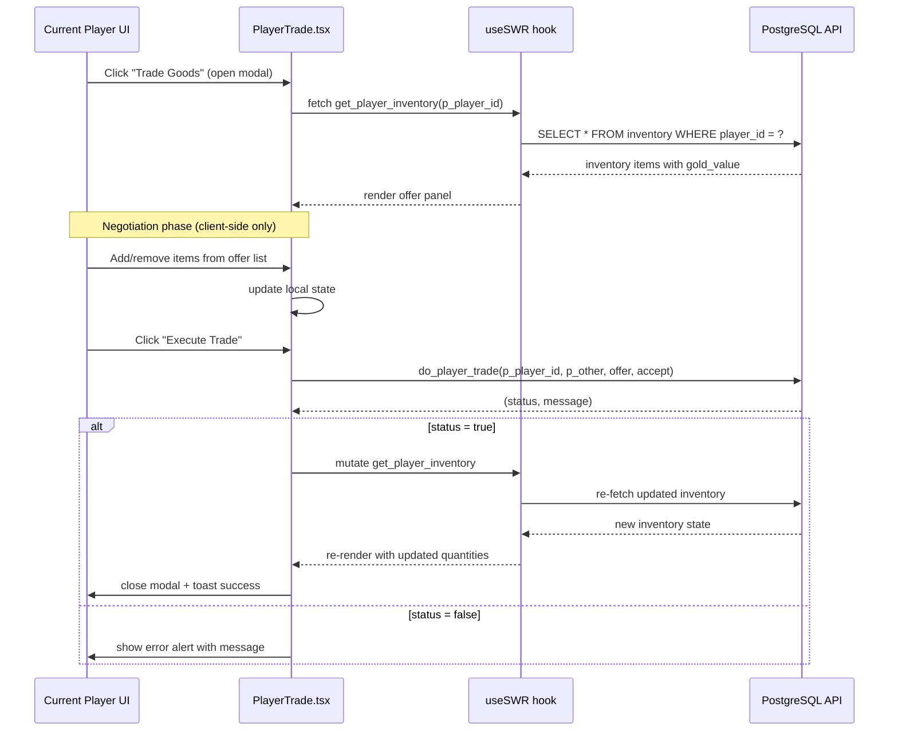
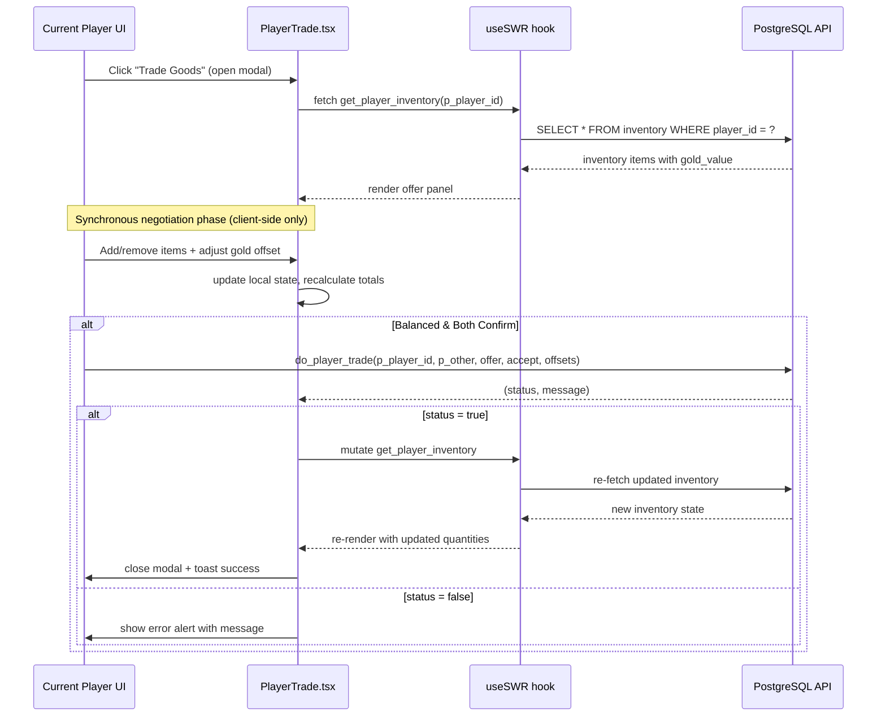

# Player trade implementation

**Session ID:** ses_224d5f369ffeMJjCWMOiayZK8M
**Created:** 4/29/2026, 11:34:19 PM
**Updated:** 4/30/2026, 12:32:16 AM

---

## User

how to implement trade between players in this game

---

## Assistant (Sql-Brainstorm · qwen3.6-35b-a3b · 67.8s)

_Thinking:_

The user wants to understand how to implement player-to-player trading in their RPG game. Let me first explore the existing API surface to understand what's available for inventory, items, and player interactions before designing a solution.

Let me start by getting the schema and relevant functions.


## Phase 1 — Understanding the Existing API Surface

Let me first explore what data and actions are already available for inventory, items, and players.

**Tool: rpg-db_get_schema**

**Input:**
```json
{
  "response_format": "json"
}
```

**Output:**
```
{
  "tables": [
    {
      "schema": "attributes",
      "table_name": "abilities",
      "columns": [
        {
          "column_name": "id",
          "data_type": "integer",
          "is_nullable": false,
          "column_default": null
        },
        {
          "column_name": "name",
          "data_type": "character varying",
          "is_nullable": false,
          "column_default": null
        },
        {
          "column_name": "description",
          "data_type": "character varying",
          "is_nullable": false,
          "column_default": null
        },
        {
          "column_name": "image",
          "data_type": "character varying",
          "is_nullable": false,
          "column_default": "'default.png'::character varying"
        }
      ]
    },
    {
      "schema": "attributes",
      "table_name": "ability_skill_requirements",
      "columns": [
        {
          "column_name": "ability_id",
          "data_type": "integer",
          "is_nullable": false,
          "column_default": null
        },
        {
          "column_name": "skill_id",
          "data_type": "integer",
          "is_nullable": false,
          "column_default": null
        },
        {
          "column_name": "min_value",
          "data_type": "integer",
          "is_nullable": false,
          "column_default": "1"
        }
      ]
    },
    {
      "schema": "attributes",
      "table_name": "ability_stat_requirements",
      "columns": [
        {
          "column_name": "ability_id",
          "data_type": "integer",
          "is_nullable": false,
          "column_default": null
        },
        {
          "column_name": "stat_id",
          "data_type": "integer",
          "is_nullable": false,
          "column_default": null
        },
        {
          "column_name": "min_value",
          "data_type": "integer",
          "is_nullable": false,
          "column_default": "1"
        }
      ]
    },
    {
      "schema": "attributes",
      "table_name": "player_abilities",
      "columns": [
        {
          "column_name": "id",
          "data_type": "integer",
          "is_nullable": false,
          "column_default": null
        },
        {
          "column_name": "player_id",
          "data_type": "integer",
          "is_nullable": false,
          "column_default": null
        },
        {
          "column_name": "ability_id",
          "data_type": "integer",
          "is_nullable": false,
          "column_default": null
        },
        {
          "column_name": "value",
          "data_type": "integer",
          "is_nullable": false,
          "column_default": null
        }
      ]
    },
    {
      "schema": "attributes",
      "table_name": "player_skills",
      "columns": [
        {
          "column_name": "id",
          "data_type": "integer",
          "is_nullable": false,
          "column_default": null
        },
        {
          "column_name": "player_id",
          "data_type": "integer",
          "is_nullable": false,
          "column_default": null
        },
        {
          "column_name": "skill_id",
          "data_type": "integer",
          "is_nullable": false,
          "column_default": null
        },
        {
          "column_name": "value",
          "data_type": "integer",
          "is_nullable": false,
          "column_default": null
        }
      ]
    },
    {
      "schema": "attributes",
      "table_name": "player_stats",
      "columns": [
        {
          "column_name": "id",
          "data_type": "integer",
          "is_nullable": false,
          "column_default": null
        },
        {
          "column_name": "player_id",
          "data_type": "integer",
          "is_nullable": false,
          "column_default": null
        },
        {
          "column_name": "stat_id",
          "data_type": "integer",
          "is_nullable": false,
          "column_default": null
        },
        {
          "column_name": "value",
          "data_type": "integer",
          "is_nullable": false,
          "column_default": null
        }
      ]
    },
    {
      "schema": "attributes",
      "table_name": "roles",
      "columns": [
        {
          "column_name": "id",
          "data_type": "integer",
          "is_nullable": false,
          "column_default": null
        },
        {
          "column_name": "name",
          "data_type": "character varying",
          "is_nullable": false,
          "column_default": null
        }
      ]
    },
    {
      "schema": "attributes",
      "table_name": "skills",
      "columns": [
        {
          "column_name": "id",
          "data_type": "integer",
          "is_nullable": false,
          "column_default": null
        },
        {
          "column_name": "name",
          "data_type": "character varying",
          "is_nullable": false,
          "column_default": null
        },
        {
          "column_name": "description",
          "data_type": "character varying",
          "is_nullable": false,
          "column_default": null
        },
        {
          "column_name": "image",
          "data_type": "character varying",
          "is_nullable": false,
          "column_default": "'default.png'::character varying"
        }
      ]
    },
    {
      "schema": "attributes",
      "table_name": "stats",
      "columns": [
        {
          "column_name": "id",
          "data_type": "integer",
          "is_nullable": false,
          "column_default": null
        },
        {
          "column_name": "name",
          "data_type": "character varying",
          "is_nullable": false,
          "column_default": null
        },
        {
          "column_name": "description",
          "data_type": "character varying",
          "is_nullable": false,
          "column_default": null
        },
        {
          "column_name": "image",
          "data_type": "character varying",
          "is_nullable": false,
          "column_default": "'default.png'::character varying"
        }
      ]
    },
    {
      "schema": "auth",
      "table_name": "accounts",
      "columns": [
        {
          "column_name": "id",
          "data_type": "integer",
          "is_nullable": false,
          "column_default": null
        },
        {
          "column_name": "userId",
          "data_type": "integer",
          "is_nullable": false,
          "column_default": null
        },
        {
          "column_name": "type",
          "data_type": "character varying",
          "is_nullable": false,
          "column_default": null
        },
        {
          "column_name": "provider",
          "data_type": "character varying",
          "is_nullable": false,
          "column_default": null
        },
        {
          "column_name": "providerAccountId",
          "data_type": "character varying",
          "is_nullable": false,
          "column_default": null
        },
        {
          "column_name": "refresh_token",
          "data_type": "text",
          "is_nullable": true,
          "column_default": null
        },
        {
          "column_name": "access_token",
          "data_type": "text",
          "is_nullable": true,
          "column_default": null
        },
        {
          "column_name": "expires_at",
          "data_type": "bigint",
          "is_nullable": true,
          "column_default": null
        },
        {
          "column_name": "id_token",
          "data_type": "text",
          "is_nullable": true,
          "column_default": null
        },
        {
          "column_name": "scope",
          "data_type": "text",
          "is_nullable": true,
          "column_default": null
        },
        {
          "column_name": "session_state",
          "data_type": "text",
          "is_nullable": true,
          "column_default": null
        },
        {
          "column_name": "token_type",
          "data_type": "text",
          "is_nullable": true,
          "column_default": null
        }
      ]
    },
    {
      "schema": "auth",
      "table_name": "sessions",
      "columns": [
        {
          "column_name": "id",
          "data_type": "integer",
          "is_nullable": false,
          "column_default": null
        },
        {
          "column_name": "userId",
          "data_type": "integer",
          "is_nullable": false,
          "column_default": null
        },
        {
          "column_name": "expires",
          "data_type": "timestamp with time zone",
          "is_nullable": false,
          "column_default": null
        },
        {
          "column_name": "sessionToken",
          "data_type": "character varying",
          "is_nullable": false,
          "column_default": null
        }
      ]
    },
    {
      "schema": "auth",
      "table_name": "users",
      "columns": [
        {
          "column_name": "id",
          "data_type": "integer",
          "is_nullable": false,
          "column_default": null
        },
        {
          "column_name": "name",
          "data_type": "character varying",
          "is_nullable": true,
          "column_default": null
        },
        {
          "column_name": "email",
          "data_type": "character varying",
          "is_nullable": true,
          "column_default": null
        },
        {
          "column_name": "emailVerified",
          "data_type": "timestamp with time zone",
          "is_nullable": true,
          "column_default": null
        },
        {
          "column_name": "image",
          "data_type": "text",
          "is_nullable": true,
          "column_default": null
        },
        {
          "column_name": "password",
          "data_type": "character varying",
          "is_nullable": true,
          "column_default": null
        }
      ]
    },
    {
      "schema": "auth",
      "table_name": "verification_token",
      "columns": [
        {
          "column_name": "identifier",
          "data_type": "text",
          "is_nullable": false,
          "column_default": null
        },
        {
          "column_name": "expires",
          "data_type": "timestamp with time zone",
          "is_nullable": false,
          "column_default": null
        },
        {
          "column_name": "token",
          "data_type": "text",
          "is_nullable": false,
          "column_default": null
        }
      ]
    },
    {
      "schema": "buildings",
      "table_name": "building_roles",
      "columns": [
        {
          "column_name": "building_id",
          "data_type": "integer",
          "is_nullable": false,
          "column_default": null
        },
        {
          "column_name": "player_id",
          "data_type": "integer",
          "is_nullable": false,
          "column_default": null
        },
        {
          "column_name": "role_id",
          "data_type": "integer",
          "is_nullable": false,
          "column_default": null
        }
      ]
    },
    {
      "schema": "buildings",
      "table_name": "building_types",
      "columns": [
        {
          "column_name": "id",
          "data_type": "integer",
          "is_nullable": false,
          "column_default": null
        },
        {
          "column_name": "name",
          "data_type": "character varying",
          "is_nullable": false,
          "column_default": null
        },
        {
          "column_name": "image_url",
          "data_type": "character varying",
          "is_nullable": true,
          "column_default": null
        }
      ]
    },
    {
      "schema": "buildings",
      "table_name": "buildings",
      "columns": [
        {
          "column_name": "id",
          "data_type": "integer",
          "is_nullable": false,
          "column_default": null
        },
        {
          "column_name": "city_id",
          "data_type": "integer",
          "is_nullable": false,
          "column_default": null
        },
        {
          "column_name": "city_tile_x",
          "data_type": "integer",
          "is_nullable": false,
          "column_default": null
        },
        {
          "column_name": "city_tile_y",
          "data_type": "integer",
          "is_nullable": false,
          "column_default": null
        },
        {
          "column_name": "building_type_id",
          "data_type": "integer",
          "is_nullable": false,
          "column_default": null
        },
        {
          "column_name": "name",
          "data_type": "character varying",
          "is_nullable": false,
          "column_default": null
        }
      ]
    },
    {
      "schema": "cities",
      "table_name": "cities",
      "columns": [
        {
          "column_name": "id",
          "data_type": "integer",
          "is_nullable": false,
          "column_default": null
        },
        {
          "column_name": "map_id",
          "data_type": "integer",
          "is_nullable": false,
          "column_default": null
        },
        {
          "column_name": "map_tile_x",
          "data_type": "integer",
          "is_nullable": false,
          "column_default": null
        },
        {
          "column_name": "map_tile_y",
          "data_type": "integer",
          "is_nullable": false,
          "column_default": null
        },
        {
          "column_name": "name",
          "data_type": "character varying",
          "is_nullable": false,
          "column_default": null
        },
        {
          "column_name": "move_cost",
          "data_type": "integer",
          "is_nullable": false,
          "column_default": null
        },
        {
          "column_name": "image_url",
          "data_type": "character varying",
          "is_nullable": true,
          "column_default": null
        }
      ]
    },
    {
      "schema": "cities",
      "table_name": "city_roles",
      "columns": [
        {
          "column_name": "city_id",
          "data_type": "integer",
          "is_nullable": false,
          "column_default": null
        },
        {
          "column_name": "player_id",
          "data_type": "integer",
          "is_nullable": false,
          "column_default": null
        },
        {
          "column_name": "role_id",
          "data_type": "integer",
          "is_nullable": false,
          "column_default": null
        }
      ]
    },
    {
      "schema": "cities",
      "table_name": "city_tiles",
      "columns": [
        {
          "column_name": "city_id",
          "data_type": "integer",
          "is_nullable": false,
          "column_default": null
        },
        {
          "column_name": "x",
          "data_type": "integer",
          "is_nullable": false,
          "column_default": null
        },
        {
          "column_name": "y",
          "data_type": "integer",
          "is_nullable": false,
          "column_default": null
        },
        {
          "column_name": "terrain_type_id",
          "data_type": "integer",
          "is_nullable": false,
          "column_default": "1"
        },
        {
          "column_name": "landscape_type_id",
          "data_type": "integer",
          "is_nullable": true,
          "column_default": null
        }
      ]
    },
    {
      "schema": "districts",
      "table_name": "district_roles",
      "columns": [
        {
          "column_name": "district_id",
          "data_type": "integer",
          "is_nullable": false,
          "column_default": null
        },
        {
          "column_name": "player_id",
          "data_type": "integer",
          "is_nullable": false,
          "column_default": null
        },
        {
          "column_name": "role_id",
          "data_type": "integer",
          "is_nullable": false,
          "column_default": null
        }
      ]
    },
    {
      "schema": "districts",
      "table_name": "district_types",
      "columns": [
        {
          "column_name": "id",
          "data_type": "integer",
          "is_nullable": false,
          "column_default": null
        },
        {
          "column_name": "name",
          "data_type": "character varying",
          "is_nullable": false,
          "column_default": null
        },
        {
          "column_name": "move_cost",
          "data_type": "integer",
          "is_nullable": false,
          "column_default": null
        },
        {
          "column_name": "image_url",
          "data_type": "character varying",
          "is_nullable": true,
          "column_default": null
        }
      ]
    },
    {
      "schema": "districts",
      "table_name": "districts",
      "columns": [
        {
          "column_name": "id",
          "data_type": "integer",
          "is_nullable": false,
          "column_default": null
        },
        {
          "column_name": "map_id",
          "data_type": "integer",
          "is_nullable": false,
          "column_default": null
        },
        {
          "column_name": "map_tile_x",
          "data_type": "integer",
          "is_nullable": false,
          "column_default": null
        },
        {
          "column_name": "map_tile_y",
          "data_type": "integer",
          "is_nullable": false,
          "column_default": null
        },
        {
          "column_name": "district_type_id",
          "data_type": "integer",
          "is_nullable": false,
          "column_default": null
        },
        {
          "column_name": "name",
          "data_type": "character varying",
          "is_nullable": true,
          "column_default": null
        }
      ]
    },
    {
      "schema": "inventory",
      "table_name": "inventory_container_player_access",
      "columns": [
        {
          "column_name": "inventory_container_id",
          "data_type": "integer",
          "is_nullable": false,
          "column_default": null
        },
        {
          "column_name": "player_id",
          "data_type": "integer",
          "is_nullable": false,
          "column_default": null
        }
      ]
    },
    {
      "schema": "inventory",
      "table_name": "inventory_container_types",
      "columns": [
        {
          "column_name": "id",
          "data_type": "integer",
          "is_nullable": false,
          "column_default": null
        },
        {
          "column_name": "name",
          "data_type": "character varying",
          "is_nullable": true,
          "column_default": null
        }
      ]
    },
    {
      "schema": "inventory",
      "table_name": "inventory_containers",
      "columns": [
        {
          "column_name": "id",
          "data_type": "integer",
          "is_nullable": false,
          "column_default": null
        },
        {
          "column_name": "inventory_size",
          "data_type": "integer",
          "is_nullable": false,
          "column_default": null
        },
        {
          "column_name": "inventory_container_type_id",
          "data_type": "integer",
          "is_nullable": false,
          "column_default": "1"
        },
        {
          "column_name": "owner_id",
          "data_type": "integer",
          "is_nullable": false,
          "column_default": null
        }
      ]
    },
    {
      "schema": "inventory",
      "table_name": "inventory_slot_type_item_type",
      "columns": [
        {
          "column_name": "inventory_slot_type_id",
          "data_type": "integer",
          "is_nullable": false,
          "column_default": null
        },
        {
          "column_name": "item_type_id",
          "data_type": "integer",
          "is_nullable": false,
          "column_default": null
        }
      ]
    },
    {
      "schema": "inventory",
      "table_name": "inventory_slot_types",
      "columns": [
        {
          "column_name": "id",
          "data_type": "integer",
          "is_nullable": false,
          "column_default": null
        },
        {
          "column_name": "name",
          "data_type": "character varying",
          "is_nullable": true,
          "column_default": null
        }
      ]
    },
    {
      "schema": "inventory",
      "table_name": "inventory_slots",
      "columns": [
        {
          "column_name": "id",
          "data_type": "integer",
          "is_nullable": false,
          "column_default": null
        },
        {
          "column_name": "inventory_container_id",
          "data_type": "integer",
          "is_nullable": false,
          "column_default": null
        },
        {
          "column_name": "item_id",
          "data_type": "integer",
          "is_nullable": true,
          "column_default": null
        },
        {
          "column_name": "quantity",
          "data_type": "integer",
          "is_nullable": true,
          "column_default": null
        },
        {
          "column_name": "inventory_slot_type_id",
          "data_type": "integer",
          "is_nullable": false,
          "column_default": null
        }
      ]
    },
    {
      "schema": "items",
      "table_name": "item_stats",
      "columns": [
        {
          "column_name": "id",
          "data_type": "integer",
          "is_nullable": false,
          "column_default": null
        },
        {
          "column_name": "item_id",
          "data_type": "integer",
          "is_nullable": false,
          "column_default": null
        },
        {
          "column_name": "stat_id",
          "data_type": "integer",
          "is_nullable": false,
          "column_default": null
        },
        {
          "column_name": "value",
          "data_type": "integer",
          "is_nullable": false,
          "column_default": null
        }
      ]
    },
    {
      "schema": "items",
      "table_name": "item_types",
      "columns": [
        {
          "column_name": "id",
          "data_type": "integer",
          "is_nullable": false,
          "column_default": null
        },
        {
          "column_name": "name",
          "data_type": "character varying",
          "is_nullable": true,
          "column_default": null
        }
      ]
    },
    {
      "schema": "items",
      "table_name": "items",
      "columns": [
        {
          "column_name": "id",
          "data_type": "integer",
          "is_nullable": false,
          "column_default": null
        },
        {
          "column_name": "name",
          "data_type": "character varying",
          "is_nullable": false,
          "column_default": null
        },
        {
          "column_name": "description",
          "data_type": "character varying",
          "is_nullable": false,
          "column_default": null
        },
        {
          "column_name": "image",
          "data_type": "character varying",
          "is_nullable": false,
          "column_default": "'default'::character varying"
        },
        {
          "column_name": "item_type_id",
          "data_type": "integer",
          "is_nullable": false,
          "column_default": "1"
        }
      ]
    },
    {
      "schema": "items",
      "table_name": "recipe_materials",
      "columns": [
        {
          "column_name": "id",
          "data_type": "integer",
          "is_nullable": false,
          "column_default": "nextval('items.recipe_materials_id_seq'::regclass)"
        },
        {
          "column_name": "recipe_id",
          "data_type": "integer",
          "is_nullable": false,
          "column_default": null
        },
        {
          "column_name": "item_id",
          "data_type": "integer",
          "is_nullable": false,
          "column_default": null
        },
        {
          "column_name": "quantity",
          "data_type": "integer",
          "is_nullable": false,
          "column_default": "1"
        }
      ]
    },
    {
      "schema": "items",
      "table_name": "recipes",
      "columns": [
        {
          "column_name": "id",
          "data_type": "integer",
          "is_nullable": false,
          "column_default": "nextval('items.recipes_id_seq'::regclass)"
        },
        {
          "column_name": "item_id",
          "data_type": "integer",
          "is_nullable": false,
          "column_default": null
        },
        {
          "column_name": "description",
          "data_type": "character varying",
          "is_nullable": true,
          "column_default": null
        },
        {
          "column_name": "skill_requirement_id",
          "data_type": "integer",
          "is_nullable": true,
          "column_default": null
        },
        {
          "column_name": "image",
          "data_type": "character varying",
          "is_nullable": true,
          "column_default": "'default_recipe.png'::character varying"
        }
      ]
    },
    {
      "schema": "knowledge",
      "table_name": "known_map_tiles",
      "columns": [
        {
          "column_name": "player_id",
          "data_type": "integer",
          "is_nullable": false,
          "column_default": null
        },
        {
          "column_name": "map_id",
          "data_type": "integer",
          "is_nullable": false,
          "column_default": null
        },
        {
          "column_name": "map_tile_x",
          "data_type": "integer",
          "is_nullable": false,
          "column_default": null
        },
        {
          "column_name": "map_tile_y",
          "data_type": "integer",
          "is_nullable": false,
          "column_default": null
        }
      ]
    },
    {
      "schema": "knowledge",
      "table_name": "known_map_tiles_resources",
      "columns": [
        {
          "column_name": "player_id",
          "data_type": "integer",
          "is_nullable": false,
          "column_default": null
        },
        {
          "column_name": "map_tiles_resource_id",
          "data_type": "integer",
          "is_nullable": false,
          "column_default": null
        }
      ]
    },
    {
      "schema": "knowledge",
      "table_name": "known_players_abilities",
      "columns": [
        {
          "column_name": "player_id",
          "data_type": "integer",
          "is_nullable": false,
          "column_default": null
        },
        {
          "column_name": "other_player_id",
          "data_type": "integer",
          "is_nullable": false,
          "column_default": null
        }
      ]
    },
    {
      "schema": "knowledge",
      "table_name": "known_players_containers",
      "columns": [
        {
          "column_name": "player_id",
          "data_type": "integer",
          "is_nullable": false,
          "column_default": null
        },
        {
          "column_name": "container_id",
          "data_type": "integer",
          "is_nullable": false,
          "column_default": null
        }
      ]
    },
    {
      "schema": "knowledge",
      "table_name": "known_players_positions",
      "columns": [
        {
          "column_name": "player_id",
          "data_type": "integer",
          "is_nullable": false,
          "column_default": null
        },
        {
          "column_name": "other_player_id",
          "data_type": "integer",
          "is_nullable": false,
          "column_default": null
        }
      ]
    },
    {
      "schema": "knowledge",
      "table_name": "known_players_profiles",
      "columns": [
        {
          "column_name": "player_id",
          "data_type": "integer",
          "is_nullable": false,
          "column_default": null
        },
        {
          "column_name": "other_player_id",
          "data_type": "integer",
          "is_nullable": false,
          "column_default": null
        }
      ]
    },
    {
      "schema": "knowledge",
      "table_name": "known_players_skills",
      "columns": [
        {
          "column_name": "player_id",
          "data_type": "integer",
          "is_nullable": false,
          "column_default": null
        },
        {
          "column_name": "other_player_id",
          "data_type": "integer",
          "is_nullable": false,
          "column_default": null
        }
      ]
    },
    {
      "schema": "knowledge",
      "table_name": "known_players_squad_profiles",
      "columns": [
        {
          "column_name": "player_id",
          "data_type": "integer",
          "is_nullable": false,
          "column_default": null
        },
        {
          "column_name": "squad_id",
          "data_type": "integer",
          "is_nullable": false,
          "column_default": null
        }
      ]
    },
    {
      "schema": "knowledge",
      "table_name": "known_players_stats",
      "columns": [
        {
          "column_name": "player_id",
          "data_type": "integer",
          "is_nullable": false,
          "column_default": null
        },
        {
          "column_name": "other_player_id",
          "data_type": "integer",
          "is_nullable": false,
          "column_default": null
        }
      ]
    },
    {
      "schema": "players",
      "table_name": "players",
      "columns": [
        {
          "column_name": "id",
          "data_type": "integer",
          "is_nullable": false,
          "column_default": null
        },
        {
          "column_name": "user_id",
          "data_type": "integer",
          "is_nullable": false,
          "column_default": null
        },
        {
          "column_name": "name",
          "data_type": "character varying",
          "is_nullable": false,
          "column_default": null
        },
        {
          "column_name": "image_map",
          "data_type": "character varying",
          "is_nullable": false,
          "column_default": "'default.png'::character varying"
        },
        {
          "column_name": "image_portrait",
          "data_type": "character varying",
          "is_nullable": false,
          "column_default": "'default.png'::character varying"
        },
        {
          "column_name": "is_active",
          "data_type": "boolean",
          "is_nullable": true,
          "column_default": "false"
        },
        {
          "column_name": "second_name",
          "data_type": "character varying",
          "is_nullable": false,
          "column_default": "'Nomad'::character varying"
        },
        {
          "column_name": "nickname",
          "data_type": "character varying",
          "is_nullable": true,
          "column_default": null
        },
        {
          "column_name": "masked_id",
          "data_type": "uuid",
          "is_nullable": true,
          "column_default": "gen_random_uuid()"
        }
      ]
    },
    {
      "schema": "squad",
      "table_name": "squad_invites",
      "columns": [
        {
          "column_name": "id",
          "data_type": "integer",
          "is_nullable": false,
          "column_default": "nextval('squad.squad_invites_id_seq'::regclass)"
        },
        {
          "column_name": "squad_id",
          "data_type": "integer",
          "is_nullable": false,
          "column_default": null
        },
        {
          "column_name": "inviter_player_id",
          "data_type": "integer",
          "is_nullable": false,
          "column_default": null
        },
        {
          "column_name": "invited_player_id",
          "data_type": "integer",
          "is_nullable": false,
          "column_default": null
        },
        {
          "column_name": "status",
          "data_type": "integer",
          "is_nullable": false,
          "column_default": "1"
        },
        {
          "column_name": "created_at",
          "data_type": "timestamp without time zone",
          "is_nullable": false,
          "column_default": "now()"
        },
        {
          "column_name": "responded_at",
          "data_type": "timestamp without time zone",
          "is_nullable": true,
          "column_default": null
        },
        {
          "column_name": "squad_role_id",
          "data_type": "integer",
          "is_nullable": false,
          "column_default": "2"
        }
      ]
    },
    {
      "schema": "squad",
      "table_name": "squad_invites_statuses",
      "columns": [
        {
          "column_name": "id",
          "data_type": "integer",
          "is_nullable": false,
          "column_default": "nextval('squad.squad_invites_statuses_id_seq'::regclass)"
        },
        {
          "column_name": "description",
          "data_type": "character varying",
          "is_nullable": true,
          "column_default": null
        }
      ]
    },
    {
      "schema": "squad",
      "table_name": "squad_players",
      "columns": [
        {
          "column_name": "squad_id",
          "data_type": "integer",
          "is_nullable": false,
          "column_default": null
        },
        {
          "column_name": "player_id",
          "data_type": "integer",
          "is_nullable": false,
          "column_default": null
        },
        {
          "column_name": "squad_role_id",
          "data_type": "integer",
          "is_nullable": false,
          "column_default": "2"
        }
      ]
    },
    {
      "schema": "squad",
      "table_name": "squad_roles",
      "columns": [
        {
          "column_name": "id",
          "data_type": "integer",
          "is_nullable": false,
          "column_default": null
        },
        {
          "column_name": "description",
          "data_type": "character varying",
          "is_nullable": true,
          "column_default": null
        }
      ]
    },
    {
      "schema": "squad",
      "table_name": "squads",
      "columns": [
        {
          "column_name": "id",
          "data_type": "integer",
          "is_nullable": false,
          "column_default": null
        },
        {
          "column_name": "squad_name",
          "data_type": "character varying",
          "is_nullable": false,
          "column_default": "'Squad'::character varying"
        },
        {
          "column_name": "squad_image_map",
          "data_type": "character varying",
          "is_nullable": false,
          "column_default": "'default.png'::character varying"
        },
        {
          "column_name": "squad_image_portrait",
          "data_type": "character varying",
          "is_nullable": false,
          "column_default": "'default.png'::character varying"
        },
        {
          "column_name": "masked_id",
          "data_type": "uuid",
          "is_nullable": true,
          "column_default": "gen_random_uuid()"
        }
      ]
    },
    {
      "schema": "tasks",
      "table_name": "status_types",
      "columns": [
        {
          "column_name": "id",
          "data_type": "integer",
          "is_nullable": false,
          "column_default": null
        },
        {
          "column_name": "name",
          "data_type": "character varying",
          "is_nullable": false,
          "column_default": null
        }
      ]
    },
    {
      "schema": "tasks",
      "table_name": "tasks",
      "columns": [
        {
          "column_name": "id",
          "data_type": "integer",
          "is_nullable": false,
          "column_default": null
        },
        {
          "column_name": "player_id",
          "data_type": "integer",
          "is_nullable": false,
          "column_default": null
        },
        {
          "column_name": "status",
          "data_type": "integer",
          "is_nullable": false,
          "column_default": null
        },
        {
          "column_name": "created_at",
          "data_type": "timestamp without time zone",
          "is_nullable": false,
          "column_default": null
        },
        {
          "column_name": "scheduled_at",
          "data_type": "timestamp without time zone",
          "is_nullable": false,
          "column_default": null
        },
        {
          "column_name": "last_executed_at",
          "data_type": "timestamp without time zone",
          "is_nullable": true,
          "column_default": null
        },
        {
          "column_name": "error",
          "data_type": "text",
          "is_nullable": true,
          "column_default": null
        },
        {
          "column_name": "method_name",
          "data_type": "character varying",
          "is_nullable": true,
          "column_default": null
        },
        {
          "column_name": "method_parameters",
          "data_type": "jsonb",
          "is_nullable": true,
          "column_default": null
        }
      ]
    },
    {
      "schema": "world",
      "table_name": "landscape_types",
      "columns": [
        {
          "column_name": "id",
          "data_type": "integer",
          "is_nullable": false,
          "column_default": null
        },
        {
          "column_name": "name",
          "data_type": "character varying",
          "is_nullable": false,
          "column_default": null
        },
        {
          "column_name": "move_cost",
          "data_type": "integer",
          "is_nullable": false,
          "column_default": null
        },
        {
          "column_name": "image_url",
          "data_type": "character varying",
          "is_nullable": true,
          "column_default": null
        }
      ]
    },
    {
      "schema": "world",
      "table_name": "map_regions",
      "columns": [
        {
          "column_name": "id",
          "data_type": "integer",
          "is_nullable": false,
          "column_default": null
        },
        {
          "column_name": "name",
          "data_type": "character varying",
          "is_nullable": false,
          "column_default": null
        },
        {
          "column_name": "region_type_id",
          "data_type": "integer",
          "is_nullable": false,
          "column_default": "1"
        },
        {
          "column_name": "image_outline",
          "data_type": "character varying",
          "is_nullable": true,
          "column_default": null
        },
        {
          "column_name": "image_fill",
          "data_type": "character varying",
          "is_nullable": true,
          "column_default": null
        }
      ]
    },
    {
      "schema": "world",
      "table_name": "map_tiles",
      "columns": [
        {
          "column_name": "map_id",
          "data_type": "integer",
          "is_nullable": false,
          "column_default": null
        },
        {
          "column_name": "x",
          "data_type": "integer",
          "is_nullable": false,
          "column_default": null
        },
        {
          "column_name": "y",
          "data_type": "integer",
          "is_nullable": false,
          "column_default": null
        },
        {
          "column_name": "terrain_type_id",
          "data_type": "integer",
          "is_nullable": false,
          "column_default": "1"
        },
        {
          "column_name": "landscape_type_id",
          "data_type": "integer",
          "is_nullable": true,
          "column_default": null
        }
      ]
    },
    {
      "schema": "world",
      "table_name": "map_tiles_map_regions",
      "columns": [
        {
          "column_name": "region_id",
          "data_type": "integer",
          "is_nullable": false,
          "column_default": null
        },
        {
          "column_name": "map_id",
          "data_type": "integer",
          "is_nullable": false,
          "column_default": null
        },
        {
          "column_name": "map_tile_x",
          "data_type": "integer",
          "is_nullable": false,
          "column_default": null
        },
        {
          "column_name": "map_tile_

... [TRUNCATED — response exceeded 40,000 characters. Use the 'schema' filter parameter to narrow your query.]
```

**Tool: rpg-db_get_functions**

**Input:**
```json
{
  "api_type": "get_api",
  "response_format": "json"
}
```

**Output:**
```
[
  {
    "schema": "attributes",
    "function_name": "get_all_abilities",
    "arguments": "p_player_id integer",
    "return_type": "TABLE(id integer, name character varying, description character varying, image character varying, value integer)",
    "api_type": "get_api"
  },
  {
    "schema": "attributes",
    "function_name": "get_all_skills",
    "arguments": "p_player_id integer",
    "return_type": "TABLE(id integer, name character varying, description character varying, image character varying, value integer)",
    "api_type": "get_api"
  },
  {
    "schema": "attributes",
    "function_name": "get_other_player_abilities",
    "arguments": "p_player_id integer, p_other_player_id text",
    "return_type": "TABLE(ability_id integer, value integer, name character varying)",
    "api_type": "get_api"
  },
  {
    "schema": "attributes",
    "function_name": "get_other_player_skills",
    "arguments": "p_player_id integer, p_other_player_id text",
    "return_type": "TABLE(skill_id integer, value integer, name character varying)",
    "api_type": "get_api"
  },
  {
    "schema": "attributes",
    "function_name": "get_other_player_stats",
    "arguments": "p_player_id integer, p_other_player_id text",
    "return_type": "TABLE(stat_id integer, value integer, name character varying)",
    "api_type": "get_api"
  },
  {
    "schema": "attributes",
    "function_name": "get_player_abilities",
    "arguments": "p_player_id integer",
    "return_type": "TABLE(ability_id integer, value integer, name character varying)",
    "api_type": "get_api"
  },
  {
    "schema": "attributes",
    "function_name": "get_player_skills",
    "arguments": "p_player_id integer",
    "return_type": "TABLE(skill_id integer, value integer, name character varying)",
    "api_type": "get_api"
  },
  {
    "schema": "attributes",
    "function_name": "get_player_stats",
    "arguments": "p_player_id integer",
    "return_type": "TABLE(stat_id integer, value integer, name character varying)",
    "api_type": "get_api"
  },
  {
    "schema": "cities",
    "function_name": "get_player_city",
    "arguments": "p_player_id integer",
    "return_type": "TABLE(city_id integer)",
    "api_type": "get_api"
  },
  {
    "schema": "inventory",
    "function_name": "get_building_inventory",
    "arguments": "p_building_id integer",
    "return_type": "TABLE(slot_id integer, container_id integer, inventory_container_type_id integer, inventory_slot_type_id integer, item_id integer, name character varying, quantity integer)",
    "api_type": "get_api"
  },
  {
    "schema": "inventory",
    "function_name": "get_district_inventory",
    "arguments": "p_district_id integer",
    "return_type": "TABLE(slot_id integer, container_id integer, inventory_container_type_id integer, inventory_slot_type_id integer, item_id integer, name character varying, quantity integer)",
    "api_type": "get_api"
  },
  {
    "schema": "inventory",
    "function_name": "get_other_player_gear_inventory",
    "arguments": "p_player_id integer, p_other_player_id text",
    "return_type": "TABLE(slot_id integer, container_id integer, inventory_container_type_id integer, inventory_slot_type_id integer, item_id integer, name character varying, quantity integer)",
    "api_type": "get_api"
  },
  {
    "schema": "inventory",
    "function_name": "get_other_player_inventory",
    "arguments": "p_player_id integer, p_other_player_id text",
    "return_type": "TABLE(slot_id integer, container_id integer, inventory_container_type_id integer, inventory_slot_type_id integer, item_id integer, name character varying, quantity integer)",
    "api_type": "get_api"
  },
  {
    "schema": "inventory",
    "function_name": "get_player_gear_inventory",
    "arguments": "p_player_id integer",
    "return_type": "TABLE(slot_id integer, container_id integer, inventory_container_type_id integer, inventory_slot_type_id integer, item_id integer, name character varying, quantity integer)",
    "api_type": "get_api"
  },
  {
    "schema": "inventory",
    "function_name": "get_player_inventory",
    "arguments": "p_player_id integer",
    "return_type": "TABLE(slot_id integer, container_id integer, inventory_container_type_id integer, inventory_slot_type_id integer, item_id integer, name character varying, quantity integer)",
    "api_type": "get_api"
  },
  {
    "schema": "items",
    "function_name": "get_player_recipe_materials",
    "arguments": "p_player_id integer, p_recipe_id integer",
    "return_type": "TABLE(id integer, recipe_id integer, item_id integer, quantity integer, owned_quantity bigint, missing_quantity bigint, can_craft_missing boolean)",
    "api_type": "get_api"
  },
  {
    "schema": "items",
    "function_name": "get_player_recipes",
    "arguments": "p_player_id integer",
    "return_type": "TABLE(id integer, item_id integer, description character varying, image character varying, skill_id integer, value integer, can_craft boolean)",
    "api_type": "get_api"
  },
  {
    "schema": "knowledge",
    "function_name": "get_player_known_players",
    "arguments": "p_player_id integer",
    "return_type": "TABLE(other_player_id text, name character varying, second_name character varying, nickname character varying, image_portrait character varying, map_id integer, x integer, y integer, image_map character varying)",
    "api_type": "get_api"
  },
  {
    "schema": "players",
    "function_name": "get_active_player_profile",
    "arguments": "p_player_id integer",
    "return_type": "TABLE(name character varying, second_name character varying, nickname character varying, image_map character varying, image_portrait character varying)",
    "api_type": "get_api"
  },
  {
    "schema": "players",
    "function_name": "get_active_player_switch_profiles",
    "arguments": "p_player_id integer",
    "return_type": "TABLE(id integer, name character varying, second_name character varying, nickname character varying, image_portrait character varying)",
    "api_type": "get_api"
  },
  {
    "schema": "players",
    "function_name": "get_other_player_profile",
    "arguments": "p_player_id integer, p_other_player_id text",
    "return_type": "TABLE(name character varying, second_name character varying, nickname character varying, image_portrait character varying)",
    "api_type": "get_api"
  },
  {
    "schema": "squad",
    "function_name": "get_active_player_squad",
    "arguments": "p_player_id integer",
    "return_type": "TABLE(squad_id integer, squad_name character varying, squad_image_portrait character varying)",
    "api_type": "get_api"
  },
  {
    "schema": "squad",
    "function_name": "get_active_player_squad_players_profiles",
    "arguments": "p_player_id integer",
    "return_type": "TABLE(other_player_id text, name character varying, second_name character varying, nickname character varying, image_map character varying, image_portrait character varying)",
    "api_type": "get_api"
  },
  {
    "schema": "squad",
    "function_name": "get_other_squad_players_profiles",
    "arguments": "p_player_id integer, p_squad_id integer",
    "return_type": "TABLE(other_player_id text, name character varying, second_name character varying, nickname character varying, image_map character varying, image_portrait character varying)",
    "api_type": "get_api"
  },
  {
    "schema": "squad",
    "function_name": "get_squad_invites",
    "arguments": "p_player_id integer",
    "return_type": "TABLE(id integer, squad_name character varying, name character varying, nickname character varying, second_name character varying, created_at timestamp without time zone)",
    "api_type": "get_api"
  },
  {
    "schema": "world",
    "function_name": "get_known_map_region",
    "arguments": "p_map_id integer, p_player_id integer, p_region_type integer",
    "return_type": "TABLE(region_id integer, map_id integer, map_tile_x integer, map_tile_y integer, region_name character varying, image_fill character varying, image_outline character varying)",
    "api_type": "get_api"
  },
  {
    "schema": "world",
    "function_name": "get_known_map_tiles",
    "arguments": "p_map_id integer, p_player_id integer",
    "return_type": "TABLE(map_id integer, x integer, y integer, terrain_type_id integer, landscape_type_id integer)",
    "api_type": "get_api"
  },
  {
    "schema": "world",
    "function_name": "get_known_map_tiles_resources_on_tile",
    "arguments": "p_map_id integer, p_map_tile_x integer, p_map_tile_y integer, p_player_id integer",
    "return_type": "TABLE(map_tiles_resource_id integer, item_id integer, quantity integer)",
    "api_type": "get_api"
  },
  {
    "schema": "world",
    "function_name": "get_known_players_positions",
    "arguments": "p_map_id integer, p_player_id integer",
    "return_type": "TABLE(x integer, y integer, other_players jsonb)",
    "api_type": "get_api"
  },
  {
    "schema": "world",
    "function_name": "get_player_map",
    "arguments": "p_player_id integer",
    "return_type": "TABLE(map_id integer)",
    "api_type": "get_api"
  },
  {
    "schema": "world",
    "function_name": "get_player_position",
    "arguments": "p_map_id integer, p_player_id integer",
    "return_type": "TABLE(x integer, y integer, image_map character varying, in_squad boolean)",
    "api_type": "get_api"
  },
  {
    "schema": "world",
    "function_name": "get_players_on_tile",
    "arguments": "p_map_id integer, p_map_tile_x integer, p_map_tile_y integer, p_player_id integer",
    "return_type": "TABLE(other_player_id text, name character varying, second_name character varying, nickname character varying, image_portrait character varying, squad_id integer, squad_name character varying, squad_image_portrait character varying)",
    "api_type": "get_api"
  }
]
```

**Tool: rpg-db_get_functions**

**Input:**
```json
{
  "api_type": "action_api",
  "response_format": "json"
}
```

**Output:**
```
[
  {
    "schema": "inventory",
    "function_name": "do_add_item_to_inventory",
    "arguments": "p_inventory_container_id integer, p_item_id integer, p_quantity integer",
    "return_type": "TABLE(status boolean, message text)",
    "api_type": "action_api"
  },
  {
    "schema": "inventory",
    "function_name": "do_add_item_to_player_inventory",
    "arguments": "p_player_id integer, p_item_id integer, p_quantity integer",
    "return_type": "TABLE(status boolean, message text)",
    "api_type": "action_api"
  },
  {
    "schema": "inventory",
    "function_name": "do_move_or_swap_item",
    "arguments": "p_player_id integer, p_from_slot_id integer, p_to_slot_id integer, p_from_inventory_container_id integer, p_to_inventory_container_id integer",
    "return_type": "TABLE(status boolean, message text)",
    "api_type": "action_api"
  },
  {
    "schema": "items",
    "function_name": "do_craft_recipe",
    "arguments": "p_player_id integer, p_recipe_id integer",
    "return_type": "TABLE(status boolean, message text)",
    "api_type": "action_api"
  },
  {
    "schema": "items",
    "function_name": "do_gather_resources_on_map_tile",
    "arguments": "p_player_id integer, p_map_id integer, p_x integer, p_y integer, p_map_tiles_resource_id integer, p_gather_amount integer",
    "return_type": "TABLE(status boolean, message text)",
    "api_type": "action_api"
  },
  {
    "schema": "players",
    "function_name": "do_switch_active_player",
    "arguments": "p_player_id integer, p_switch_to_player_id integer",
    "return_type": "TABLE(status boolean, message text)",
    "api_type": "action_api"
  },
  {
    "schema": "squad",
    "function_name": "do_squad_create",
    "arguments": "p_player_id integer",
    "return_type": "TABLE(status boolean, message text)",
    "api_type": "action_api"
  },
  {
    "schema": "squad",
    "function_name": "do_squad_invite",
    "arguments": "p_player_id integer, p_invited_player_id text, p_invite_type integer, p_squad_role integer",
    "return_type": "TABLE(status boolean, message text)",
    "api_type": "action_api"
  },
  {
    "schema": "squad",
    "function_name": "do_squad_join",
    "arguments": "p_player_id integer, p_squad_invite_id integer",
    "return_type": "TABLE(status boolean, message text)",
    "api_type": "action_api"
  },
  {
    "schema": "squad",
    "function_name": "do_squad_leave",
    "arguments": "p_player_id integer",
    "return_type": "TABLE(status boolean, message text)",
    "api_type": "action_api"
  },
  {
    "schema": "world",
    "function_name": "do_map_tile_exploration",
    "arguments": "p_player_id integer, p_map_id integer, p_x integer, p_y integer, p_exploration_level integer",
    "return_type": "TABLE(status boolean, message text)",
    "api_type": "action_api"
  },
  {
    "schema": "world",
    "function_name": "do_player_movement",
    "arguments": "p_player_id integer, p_path jsonb",
    "return_type": "TABLE(status boolean, message text)",
    "api_type": "action_api"
  }
]
```

**Tool: rpg-db_get_functions**

**Input:**
```json
{
  "api_type": "automatic_get_api",
  "response_format": "json"
}
```

**Output:**
```
[
  {
    "schema": "attributes",
    "function_name": "get_abilities",
    "arguments": "",
    "return_type": "SETOF attributes.abilities",
    "api_type": "automatic_get_api"
  },
  {
    "schema": "attributes",
    "function_name": "get_abilities_by_key",
    "arguments": "p_name character varying",
    "return_type": "SETOF attributes.abilities",
    "api_type": "automatic_get_api"
  },
  {
    "schema": "attributes",
    "function_name": "get_abilities_by_key",
    "arguments": "p_id integer",
    "return_type": "SETOF attributes.abilities",
    "api_type": "automatic_get_api"
  },
  {
    "schema": "attributes",
    "function_name": "get_roles",
    "arguments": "",
    "return_type": "SETOF attributes.roles",
    "api_type": "automatic_get_api"
  },
  {
    "schema": "attributes",
    "function_name": "get_roles_by_key",
    "arguments": "p_id integer",
    "return_type": "SETOF attributes.roles",
    "api_type": "automatic_get_api"
  },
  {
    "schema": "attributes",
    "function_name": "get_skills",
    "arguments": "",
    "return_type": "SETOF attributes.skills",
    "api_type": "automatic_get_api"
  },
  {
    "schema": "attributes",
    "function_name": "get_skills_by_key",
    "arguments": "p_id integer",
    "return_type": "SETOF attributes.skills",
    "api_type": "automatic_get_api"
  },
  {
    "schema": "attributes",
    "function_name": "get_stats",
    "arguments": "",
    "return_type": "SETOF attributes.stats",
    "api_type": "automatic_get_api"
  },
  {
    "schema": "attributes",
    "function_name": "get_stats_by_key",
    "arguments": "p_id integer",
    "return_type": "SETOF attributes.stats",
    "api_type": "automatic_get_api"
  },
  {
    "schema": "buildings",
    "function_name": "get_building_types",
    "arguments": "",
    "return_type": "SETOF buildings.building_types",
    "api_type": "automatic_get_api"
  },
  {
    "schema": "buildings",
    "function_name": "get_building_types_by_key",
    "arguments": "p_id integer",
    "return_type": "SETOF buildings.building_types",
    "api_type": "automatic_get_api"
  },
  {
    "schema": "buildings",
    "function_name": "get_buildings",
    "arguments": "",
    "return_type": "SETOF buildings.buildings",
    "api_type": "automatic_get_api"
  },
  {
    "schema": "buildings",
    "function_name": "get_buildings_by_key",
    "arguments": "p_city_id integer",
    "return_type": "SETOF buildings.buildings",
    "api_type": "automatic_get_api"
  },
  {
    "schema": "cities",
    "function_name": "get_cities",
    "arguments": "",
    "return_type": "SETOF cities.cities",
    "api_type": "automatic_get_api"
  },
  {
    "schema": "cities",
    "function_name": "get_cities_by_key",
    "arguments": "p_map_id integer",
    "return_type": "SETOF cities.cities",
    "api_type": "automatic_get_api"
  },
  {
    "schema": "cities",
    "function_name": "get_city_tiles",
    "arguments": "",
    "return_type": "SETOF cities.city_tiles",
    "api_type": "automatic_get_api"
  },
  {
    "schema": "cities",
    "function_name": "get_city_tiles_by_key",
    "arguments": "p_city_id integer",
    "return_type": "SETOF cities.city_tiles",
    "api_type": "automatic_get_api"
  },
  {
    "schema": "districts",
    "function_name": "get_district_types",
    "arguments": "",
    "return_type": "SETOF districts.district_types",
    "api_type": "automatic_get_api"
  },
  {
    "schema": "districts",
    "function_name": "get_district_types_by_key",
    "arguments": "p_id integer",
    "return_type": "SETOF districts.district_types",
    "api_type": "automatic_get_api"
  },
  {
    "schema": "districts",
    "function_name": "get_districts",
    "arguments": "",
    "return_type": "SETOF districts.districts",
    "api_type": "automatic_get_api"
  },
  {
    "schema": "districts",
    "function_name": "get_districts_by_key",
    "arguments": "p_map_id integer",
    "return_type": "SETOF districts.districts",
    "api_type": "automatic_get_api"
  },
  {
    "schema": "inventory",
    "function_name": "get_inventory_slot_types",
    "arguments": "",
    "return_type": "SETOF inventory.inventory_slot_types",
    "api_type": "automatic_get_api"
  },
  {
    "schema": "inventory",
    "function_name": "get_inventory_slot_types_by_key",
    "arguments": "p_id integer",
    "return_type": "SETOF inventory.inventory_slot_types",
    "api_type": "automatic_get_api"
  },
  {
    "schema": "items",
    "function_name": "get_item_stats",
    "arguments": "",
    "return_type": "SETOF items.item_stats",
    "api_type": "automatic_get_api"
  },
  {
    "schema": "items",
    "function_name": "get_item_stats_by_key",
    "arguments": "p_id integer",
    "return_type": "SETOF items.item_stats",
    "api_type": "automatic_get_api"
  },
  {
    "schema": "items",
    "function_name": "get_items",
    "arguments": "",
    "return_type": "SETOF items.items",
    "api_type": "automatic_get_api"
  },
  {
    "schema": "items",
    "function_name": "get_items_by_key",
    "arguments": "p_id integer",
    "return_type": "SETOF items.items",
    "api_type": "automatic_get_api"
  },
  {
    "schema": "items",
    "function_name": "get_recipe_materials",
    "arguments": "",
    "return_type": "SETOF items.recipe_materials",
    "api_type": "automatic_get_api"
  },
  {
    "schema": "items",
    "function_name": "get_recipe_materials_by_key",
    "arguments": "p_recipe_id integer",
    "return_type": "SETOF items.recipe_materials",
    "api_type": "automatic_get_api"
  },
  {
    "schema": "world",
    "function_name": "get_landscape_types",
    "arguments": "",
    "return_type": "SETOF world.landscape_types",
    "api_type": "automatic_get_api"
  },
  {
    "schema": "world",
    "function_name": "get_landscape_types_by_key",
    "arguments": "p_id integer",
    "return_type": "SETOF world.landscape_types",
    "api_type": "automatic_get_api"
  },
  {
    "schema": "world",
    "function_name": "get_map_tiles",
    "arguments": "",
    "return_type": "SETOF world.map_tiles",
    "api_type": "automatic_get_api"
  },
  {
    "schema": "world",
    "function_name": "get_map_tiles_by_key",
    "arguments": "p_map_id integer",
    "return_type": "SETOF world.map_tiles",
    "api_type": "automatic_get_api"
  },
  {
    "schema": "world",
    "function_name": "get_terrain_types",
    "arguments": "",
    "return_type": "SETOF world.terrain_types",
    "api_type": "automatic_get_api"
  },
  {
    "schema": "world",
    "function_name": "get_terrain_types_by_key",
    "arguments": "p_id integer",
    "return_type": "SETOF world.terrain_types",
    "api_type": "automatic_get_api"
  }
]
```

---

## Assistant (Sql-Brainstorm · qwen3.6-35b-a3b · 282.0s)

_Thinking:_

Now I have a good understanding of the API surface. Let me analyze what's available and what's missing for player-to-player trading:

**Existing Inventory Functions:**
- `get_player_inventory(p_player_id)` → returns slots with items, quantities
- `get_other_player_inventory(p_player_id, p_other_player_id)` → returns another player's inventory (respects knowledge)
- `get_player_gear_inventory(p_player_id)` → gear specifically
- `get_building_inventory(p_building_id)` → building storage
- `do_add_item_to_inventory(container_id, item_id, quantity)` → add to container


- `do_add_item_to_player_inventory(player_id, item_id, quantity)` → direct player addition
- `do_move_or_swap_item(player_id, from_slot, to_slot, from_container, to_container)` → move items between containers

**Existing Player Interaction Functions:**
- `get_players_on_tile(map_id, x, y, p_player_id)` → see who's on the same tile
- `get_other_player_profile(p_player_id, p_other_player_id)` → view another player's profile
- `do_squad_invite` / `do_squad_join` → squad mechanics

**What's MISSING for trading:**
There's no existing trade system in place—no trade request function, no trade acceptance mechanism, and no dedicated trade action to execute the actual exchange. I need to design this from scratch using what's already available. Let me check how the inventory functions work internally to understand the patterns better.


Let me look at key function definitions to understand exact return shapes and patterns:

**Tool: rpg-db_get_function_definition**

**Input:**
```json
{
  "function_name": "get_player_inventory",
  "response_format": "json",
  "schema": "inventory"
}
```

**Output:**
```
[
  {
    "schema": "inventory",
    "function_name": "get_player_inventory",
    "arguments": "p_player_id integer",
    "return_type": "TABLE(slot_id integer, container_id integer, inventory_container_type_id integer, inventory_slot_type_id integer, item_id integer, name character varying, quantity integer)",
    "comment": "get_api",
    "kind": "function",
    "language": "plpgsql",
    "definition": "CREATE OR REPLACE FUNCTION inventory.get_player_inventory(p_player_id integer)\n RETURNS TABLE(slot_id integer, container_id integer, inventory_container_type_id integer, inventory_slot_type_id integer, item_id integer, name character varying, quantity integer)\n LANGUAGE plpgsql\nAS $function$\r\nBEGIN\r\n    RETURN QUERY\r\n    SELECT t3.id AS slot_id,\r\n           t1.id AS container_id,\r\n           t1.inventory_container_type_id,\r\n           t3.inventory_slot_type_id,\r\n           t3.item_id,\r\n           t4.name,\r\n           t3.quantity\r\n    FROM inventory.inventory_containers t1  \r\n    JOIN inventory.inventory_slots t3 ON t3.inventory_container_id = t1.id\r\n    LEFT JOIN items.items T4 ON T3.item_id = T4.id\r\n    WHERE t1.owner_id = p_player_id AND t1.inventory_container_type_id = 1\r\n    ORDER BY t3.id ASC;\r\nEND;\r\n$function$\n"
  }
]
```

**Tool: rpg-db_get_function_definition**

**Input:**
```json
{
  "function_name": "get_other_player_inventory",
  "response_format": "json",
  "schema": "inventory"
}
```

**Output:**
```
[
  {
    "schema": "inventory",
    "function_name": "get_other_player_inventory",
    "arguments": "p_player_id integer, p_other_player_id text",
    "return_type": "TABLE(slot_id integer, container_id integer, inventory_container_type_id integer, inventory_slot_type_id integer, item_id integer, name character varying, quantity integer)",
    "comment": "get_api",
    "kind": "function",
    "language": "plpgsql",
    "definition": "CREATE OR REPLACE FUNCTION inventory.get_other_player_inventory(p_player_id integer, p_other_player_id text)\n RETURNS TABLE(slot_id integer, container_id integer, inventory_container_type_id integer, inventory_slot_type_id integer, item_id integer, name character varying, quantity integer)\n LANGUAGE plpgsql\nAS $function$\r\nBEGIN\r\n    RETURN QUERY\r\n    SELECT t3.id AS slot_id,\r\n           t1.id AS container_id,\r\n           t1.inventory_container_type_id,\r\n           t3.inventory_slot_type_id,\r\n           t3.item_id,\r\n           t4.name,\r\n           t3.quantity        \r\n            FROM players.players p\r\n            JOIN inventory.inventory_containers t1 ON t1.owner_id = p.id\r\n                                                   AND t1.inventory_container_type_id = 1\r\n            JOIN knowledge.known_players_containers kpc ON kpc.player_id = p_player_id\r\n                                               AND kpc.container_id = t1.id\r\n            JOIN inventory.inventory_slots t3 ON t3.inventory_container_id = t1.id\r\n            LEFT JOIN items.items T4 ON T3.item_id = T4.id\r\n            WHERE p.id = players.get_real_player_id(p_other_player_id)\r\n            ORDER BY t3.id ASC;\r\n\r\nEND;\r\n$function$\n"
  }
]
```

**Tool: rpg-db_get_function_definition**

**Input:**
```json
{
  "function_name": "do_move_or_swap_item",
  "response_format": "json",
  "schema": "inventory"
}
```

**Output:**
```
[
  {
    "schema": "inventory",
    "function_name": "do_move_or_swap_item",
    "arguments": "p_player_id integer, p_from_slot_id integer, p_to_slot_id integer, p_from_inventory_container_id integer, p_to_inventory_container_id integer",
    "return_type": "TABLE(status boolean, message text)",
    "comment": "action_api",
    "kind": "function",
    "language": "plpgsql",
    "definition": "CREATE OR REPLACE FUNCTION inventory.do_move_or_swap_item(p_player_id integer, p_from_slot_id integer, p_to_slot_id integer, p_from_inventory_container_id integer, p_to_inventory_container_id integer)\n RETURNS TABLE(status boolean, message text)\n LANGUAGE plpgsql\nAS $function$\r\n\r\nBEGIN\r\n\r\nPERFORM inventory.move_or_swap_item(\n    p_player_id,\r\n    p_from_slot_id,\r\n    p_to_slot_id,\r\n    p_from_inventory_container_id,\r\n\tp_to_inventory_container_id\r\n);\r\n\r\n        \r\n    RETURN QUERY SELECT true, 'Item transferred successfully';\r\n    \r\n    EXCEPTION\r\n        WHEN OTHERS THEN\r\n            IF SQLSTATE = 'P0001' THEN\r\n                RETURN QUERY SELECT false, SQLERRM;\r\n            ELSE\r\n                RAISE;\r\n            END IF;\r\n\r\nEND;\r\n$function$\n"
  }
]
```

**Tool: rpg-db_get_function_definition**

**Input:**
```json
{
  "function_name": "get_players_on_tile",
  "response_format": "json",
  "schema": "world"
}
```

**Output:**
```
[
  {
    "schema": "world",
    "function_name": "get_players_on_tile",
    "arguments": "p_map_id integer, p_map_tile_x integer, p_map_tile_y integer, p_player_id integer",
    "return_type": "TABLE(other_player_id text, name character varying, second_name character varying, nickname character varying, image_portrait character varying, squad_id integer, squad_name character varying, squad_image_portrait character varying)",
    "comment": "get_api",
    "kind": "function",
    "language": "plpgsql",
    "definition": "CREATE OR REPLACE FUNCTION world.get_players_on_tile(p_map_id integer, p_map_tile_x integer, p_map_tile_y integer, p_player_id integer)\n RETURNS TABLE(other_player_id text, name character varying, second_name character varying, nickname character varying, image_portrait character varying, squad_id integer, squad_name character varying, squad_image_portrait character varying)\n LANGUAGE plpgsql\nAS $function$\r\nDECLARE\r\n\r\nBEGIN\r\n\r\nIF EXISTS (\r\n    SELECT 1\r\n     FROM world.map_tiles_players_positions\r\n     WHERE map_id = p_map_id\r\n      AND player_id = p_player_id\r\n      AND map_tile_x = p_map_tile_x\r\n      AND map_tile_y = p_map_tile_y\r\n    ) THEN\r\n\r\nRETURN QUERY          \r\nSELECT       CASE WHEN kpp.other_player_id IS NOT NULL THEN kpp.other_player_id::text ELSE p.masked_id::text END AS other_player_id\r\n            ,CASE WHEN kpp.other_player_id IS NOT NULL THEN p.name ELSE NULL END AS name\r\n            ,CASE WHEN kpp.other_player_id IS NOT NULL THEN p.second_name ELSE NULL END AS second_name\r\n            ,CASE WHEN kpp.other_player_id IS NOT NULL THEN p.nickname ELSE NULL END AS nickname\r\n            ,CASE WHEN kpp.other_player_id IS NOT NULL THEN p.image_portrait ELSE NULL END AS image_portrait\r\n            ,S.id AS squad_id\r\n            ,S.squad_name\r\n            ,S.squad_image_portrait \r\nFROM world.map_tiles_players_positions mp\r\nJOIN players.players p ON mp.player_id = p.id\r\nLEFT JOIN knowledge.known_players_profiles kpp ON kpp.player_id = p_player_id\r\n                                               AND kpp.other_player_id = p.id\r\nLEFT JOIN squad.squad_players SP ON SP.player_id = mp.player_id\r\nLEFT JOIN squad.squads S ON S.id = SP.squad_id\r\nWHERE mp.map_tile_x = p_map_tile_x\r\nAND mp.map_tile_y = p_map_tile_y\r\nAND mp.map_id = p_map_id\r\nAND mp.player_id != p_player_id;\r\n\r\nELSE\r\n\r\nRETURN QUERY          \r\nSELECT       CASE WHEN kpp.other_player_id IS NOT NULL THEN kpp.other_player_id::text ELSE p.masked_id::text END AS other_player_id\r\n            ,CASE WHEN kpp.other_player_id IS NOT NULL THEN p.name ELSE NULL END AS name\r\n            ,CASE WHEN kpp.other_player_id IS NOT NULL THEN p.second_name ELSE NULL END AS second_name\r\n            ,CASE WHEN kpp.other_player_id IS NOT NULL THEN p.nickname ELSE NULL END AS nickname\r\n            ,CASE WHEN kpp.other_player_id IS NOT NULL THEN p.image_portrait ELSE NULL END AS image_portrait\r\n            ,S.id AS squad_id\r\n            ,S.squad_name\r\n            ,S.squad_image_portrait \r\nFROM world.map_tiles_players_positions mp\r\nJOIN players.players p ON mp.player_id = p.id\r\nJOIN knowledge.known_players_positions kp ON p.id = kp.other_player_id\r\nLEFT JOIN knowledge.known_players_profiles kpp ON kpp.player_id = p_player_id\r\n                                               AND kpp.other_player_id = p.id\r\nLEFT JOIN squad.squad_players SP ON SP.player_id = mp.player_id\r\nLEFT JOIN squad.squads S ON S.id = SP.squad_id\r\nWHERE mp.map_tile_x = p_map_tile_x\r\nAND mp.map_tile_y = p_map_tile_y\r\nAND mp.map_id = p_map_id\r\nAND kp.player_id = p_player_id\r\nAND mp.player_id != p_player_id ;\r\n\r\nEND IF;\r\n\r\n\r\nEND;\r\n$function$\n"
  }
]
```

---

## Assistant (Sql-Brainstorm · qwen3.6-35b-a3b · 279.8s)

_Thinking:_

Now let me check the inventory_containers and inventory_slots tables to understand the container structure better:


Let me also check the table structures for containers and slots, plus look at how squad invites work (as a pattern for trade requests):

**Tool: rpg-db_get_tables**

**Input:**
```json
{
  "response_format": "json",
  "schema": "inventory"
}
```

**Output:**
```
[
  {
    "schema": "inventory",
    "table_name": "inventory_container_player_access",
    "columns": [
      {
        "column_name": "inventory_container_id",
        "data_type": "integer",
        "is_nullable": false,
        "column_default": null
      },
      {
        "column_name": "player_id",
        "data_type": "integer",
        "is_nullable": false,
        "column_default": null
      }
    ]
  },
  {
    "schema": "inventory",
    "table_name": "inventory_container_types",
    "columns": [
      {
        "column_name": "id",
        "data_type": "integer",
        "is_nullable": false,
        "column_default": null
      },
      {
        "column_name": "name",
        "data_type": "character varying",
        "is_nullable": true,
        "column_default": null
      }
    ]
  },
  {
    "schema": "inventory",
    "table_name": "inventory_containers",
    "columns": [
      {
        "column_name": "id",
        "data_type": "integer",
        "is_nullable": false,
        "column_default": null
      },
      {
        "column_name": "inventory_size",
        "data_type": "integer",
        "is_nullable": false,
        "column_default": null
      },
      {
        "column_name": "inventory_container_type_id",
        "data_type": "integer",
        "is_nullable": false,
        "column_default": "1"
      },
      {
        "column_name": "owner_id",
        "data_type": "integer",
        "is_nullable": false,
        "column_default": null
      }
    ]
  },
  {
    "schema": "inventory",
    "table_name": "inventory_slot_type_item_type",
    "columns": [
      {
        "column_name": "inventory_slot_type_id",
        "data_type": "integer",
        "is_nullable": false,
        "column_default": null
      },
      {
        "column_name": "item_type_id",
        "data_type": "integer",
        "is_nullable": false,
        "column_default": null
      }
    ]
  },
  {
    "schema": "inventory",
    "table_name": "inventory_slot_types",
    "columns": [
      {
        "column_name": "id",
        "data_type": "integer",
        "is_nullable": false,
        "column_default": null
      },
      {
        "column_name": "name",
        "data_type": "character varying",
        "is_nullable": true,
        "column_default": null
      }
    ]
  },
  {
    "schema": "inventory",
    "table_name": "inventory_slots",
    "columns": [
      {
        "column_name": "id",
        "data_type": "integer",
        "is_nullable": false,
        "column_default": null
      },
      {
        "column_name": "inventory_container_id",
        "data_type": "integer",
        "is_nullable": false,
        "column_default": null
      },
      {
        "column_name": "item_id",
        "data_type": "integer",
        "is_nullable": true,
        "column_default": null
      },
      {
        "column_name": "quantity",
        "data_type": "integer",
        "is_nullable": true,
        "column_default": null
      },
      {
        "column_name": "inventory_slot_type_id",
        "data_type": "integer",
        "is_nullable": false,
        "column_default": null
      }
    ]
  }
]
```

**Tool: rpg-db_get_function_definition**

**Input:**
```json
{
  "function_name": "do_squad_invite",
  "response_format": "json",
  "schema": "squad"
}
```

**Output:**
```
[
  {
    "schema": "squad",
    "function_name": "do_squad_invite",
    "arguments": "p_player_id integer, p_invited_player_id text, p_invite_type integer, p_squad_role integer",
    "return_type": "TABLE(status boolean, message text)",
    "comment": "action_api",
    "kind": "function",
    "language": "plpgsql",
    "definition": "CREATE OR REPLACE FUNCTION squad.do_squad_invite(p_player_id integer, p_invited_player_id text, p_invite_type integer, p_squad_role integer)\n RETURNS TABLE(status boolean, message text)\n LANGUAGE plpgsql\nAS $function$\r\nBEGIN\r\n\r\n    /* MUTEX */\r\n    PERFORM 1\r\n    FROM players.players\r\n    WHERE id = p_player_id\r\n    FOR UPDATE;\r\n\r\nPERFORM squad.squad_invite(p_player_id,p_invited_player_id, p_invite_type, p_squad_role);\r\n\r\n    RETURN QUERY SELECT true, 'Invited to squad';\r\n\r\n    EXCEPTION\r\n        WHEN OTHERS THEN\r\n            IF SQLSTATE = 'P0001' THEN\r\n                RETURN QUERY SELECT false, SQLERRM;\r\n            ELSE\r\n                RAISE;\r\n            END IF;\r\n\r\nEND;\r\n$function$\n"
  }
]
```

---

## Assistant (Sql-Brainstorm · qwen3.6-35b-a3b · 289.5s)

_Thinking:_

Now I have a solid understanding of the API surface. Let me also check what inventory_container_type_id = 1 means (player inventory), and look at the items table:


Let me check the container types and items table structure:

**Tool: rpg-db_get_function_definition**

**Input:**
```json
{
  "function_name": "get_inventory_slot_types",
  "response_format": "json",
  "schema": "inventory"
}
```

**Output:**
```
[
  {
    "schema": "inventory",
    "function_name": "get_inventory_slot_types",
    "arguments": "",
    "return_type": "SETOF inventory.inventory_slot_types",
    "comment": "automatic_get_api",
    "kind": "function",
    "language": "plpgsql",
    "definition": "CREATE OR REPLACE FUNCTION inventory.get_inventory_slot_types()\n RETURNS SETOF inventory.inventory_slot_types\n LANGUAGE plpgsql\nAS $function$\r\n      BEGIN\r\n      -- GENERATED CODE - DO NOT EDIT MANUALLY - getTable.js\r\n          RETURN QUERY\r\n          SELECT * FROM inventory.inventory_slot_types;\r\n      END;\r\n      $function$\n"
  }
]
```

**Tool: rpg-db_get_function_definition**

**Input:**
```json
{
  "function_name": "get_items",
  "response_format": "json",
  "schema": "items"
}
```

**Output:**
```
[
  {
    "schema": "items",
    "function_name": "get_items",
    "arguments": "",
    "return_type": "SETOF items.items",
    "comment": "automatic_get_api",
    "kind": "function",
    "language": "plpgsql",
    "definition": "CREATE OR REPLACE FUNCTION items.get_items()\n RETURNS SETOF items.items\n LANGUAGE plpgsql\nAS $function$\r\n      BEGIN\r\n      -- GENERATED CODE - DO NOT EDIT MANUALLY - getTable.js\r\n          RETURN QUERY\r\n          SELECT * FROM items.items;\r\n      END;\r\n      $function$\n"
  }
]
```

---

## Assistant (Sql-Brainstorm · qwen3.6-35b-a3b · 284.0s)

_Thinking:_

Now I have a comprehensive understanding of the API surface. Let me also check if there's any existing trade-related code in the project:


Let me search for any existing trade-related patterns in the codebase and check how squad invites are handled on the frontend:

**Tool: grep**

**Input:**
```json
{
  "pattern": "trade|Trade|TRADE",
  "path": "/mnt/c/GithubApps/Sybath/sybath"
}
```

**Output:**
```
Found 37 matches
/mnt/c/GithubApps/Sybath/sybath/db/backup/session-ses_2260.md:
  Line 3275: | Trade | 1 | Low cost social action |

/mnt/c/GithubApps/Sybath/sybath/components/map/MapTileDetail.tsx:
  Line 268:               <Button className={styles.actionButton}>Set Special Place Like TradePost or church</Button>

/mnt/c/GithubApps/Sybath/sybath/.todo/ToDoList.txt:
  Line 15: --wymiana inventory miedzy graczami, budynkami, squadami (ogolny panel trade na centrum ekranu ?)

/mnt/c/GithubApps/Sybath/sybath/.todo/cities.txt:
  Line 10:   Trade normalny tylko ustawianie ceny dla citizens/obcy z czego AI zawsze bieze za darmo jedzenie jedyne ograniczenie to zakaz handlu foodem !

/mnt/c/GithubApps/Sybath/sybath/db/backup/20260402.sql:
  Line 5501: 3	Trade	How cheap can you buy ?	HandCoinsIcon

/mnt/c/GithubApps/Sybath/sybath/db/backup/20260331.sql:
  Line 5396: 3	Trade	How cheap can you buy ?	HandCoinsIcon

/mnt/c/GithubApps/Sybath/sybath/db/backup/20260325.sql:
  Line 5193: 3	Trade	How cheap can you buy ?	HandCoinsIcon

/mnt/c/GithubApps/Sybath/sybath/.opencode/skills/sql-game-design/SKILL.md:
  Line 110: **Ask:** Create / join / move / craft / trade / destroy? What can go wrong?

/mnt/c/GithubApps/Sybath/sybath/components/GeneratedComponents/OtherPlayerActions.tsx:
  Line 63:           { id: "trade", label: "Trade Goods", icon: Gift, cost: { gold: 100 } },
  Line 91:           { id: "trade", label: "Trade Goods", icon: Gift, cost: { gold: 100 } },
  Line 119:           { id: "trade", label: "Trade Goods", icon: Gift, cost: { gold: 100 } },
  Line 361:               <Badge variant='outline'>Trade</Badge>
  Line 433:                 onClick={() => handleAction(selectedPlayer, "trade")}
  Line 436:                 Initiate Trade

/mnt/c/GithubApps/Sybath/sybath/components/GeneratedComponents/KnowledgeTree.tsx:
  Line 105:       { id: "2", name: "Diplomacy", icon: Landmark, description: "+10% trade success rate", cost: 3, learned: false },

/mnt/c/GithubApps/Sybath/sybath/.opencode/wywolania.txt:
  Line 11: "OtherPlayerActions" "This UI is used by the player to see what actions can player interact with other players like trade, invite to squad just like in multiplayer and rpg games. Think and add some ideas what to show here please from RPG and strategic games" "think for yourself" 
  Line 26: TradePanel

/mnt/c/GithubApps/Sybath/sybath/components/GeneratedComponents/PlayerTrade.tsx:
  Line 2:  * Player Trade Interface Component
  Line 10: import styles from "./styles/PlayerTrade.module.css"
  Line 31: interface PlayerTradeProps {
  Line 37: export default function PlayerTrade({
  Line 41: }: PlayerTradeProps) {
  Line 78:   // Handle trade confirmation
  Line 79:   const handleConfirmTrade = () => {
  Line 81:       alert("Trade values must be equal!")
  Line 110:       {/* Trade Panel Header */}
  Line 133:         {/* Trade Status */}
  Line 143:       {/* Trade Items Section */}
  Line 146:         <div className={`${styles.tradePanel} ${styles.offerPanel}`}>
  Line 195:         <div className={`${styles.tradePanel} ${styles.acceptPanel}`}>
  Line 244:       {/* Trade Actions */}
  Line 257:               Cancel Trade
  Line 261:               onClick={handleConfirmTrade}
  Line 274:           <span>Trade values must be equal before confirmation</span>

/mnt/c/GithubApps/Sybath/sybath/components/GeneratedComponents/styles/PlayerTrade.module.css:
  Line 1: /* Player Trade Component Styles */
  Line 104: .tradePanel {

/mnt/c/GithubApps/Sybath/sybath/db/backup/20260312.sql:
  Line 5214: 3	Trade	How cheap can you buy ?	HandCoinsIcon
```

**Tool: glob**

**Input:**
```json
{
  "pattern": "**/*squad*invite*",
  "path": "/mnt/c/GithubApps/Sybath/sybath"
}
```

**Output:**
```
/mnt/c/GithubApps/Sybath/sybath/plop-generators/answerHistory/getMethodAction/squad_do_squad_invite_answers.json
/mnt/c/GithubApps/Sybath/sybath/plop-generators/answerHistory/getMethodFetcher/squad_get_squad_invites_answers.json
```

---

## Assistant (Sql-Brainstorm · qwen3.6-35b-a3b · 281.3s)

_Thinking:_

There's already a `PlayerTrade.tsx` component! Let me look at it and the existing trade-related code more carefully.


There's already an existing `PlayerTrade.tsx` component. Let me examine it along with how squad invites work:

**Tool: read**

**Input:**
```json
{
  "filePath": "/mnt/c/GithubApps/Sybath/sybath/components/GeneratedComponents/PlayerTrade.tsx"
}
```

**Output:**
```
<path>/mnt/c/GithubApps/Sybath/sybath/components/GeneratedComponents/PlayerTrade.tsx</path>
<type>file</type>
<content>1: /**
2:  * Player Trade Interface Component
3:  *
4:  * A medieval-style trading panel for player-to-player item exchange
5:  * Inspired by Crusader Kings grand strategy game UI
6:  */
7: 
8: import { AlertTriangle, CheckCircle2, Coins, Crown, Scroll, Shield, User, X } from "lucide-react"
9: import React, { useState } from "react"
10: import styles from "./styles/PlayerTrade.module.css"
11: 
12: // Mock data for demonstration
13: const MOCK_OFFER_ITEMS = [
14:   { id: 1, name: "Iron Sword", type: "weapon", value: 50, icon: Shield },
15:   { id: 2, name: "Gold Coins", type: "currency", value: 100, icon: Coins },
16: ]
17: 
18: const MOCK_ACCEPT_ITEMS = [
19:   { id: 3, name: "Leather Armor", type: "armor", value: 75, icon: Shield },
20:   { id: 4, name: "Ancient Scroll", type: "artifact", value: 200, icon: Scroll },
21: ]
22: 
23: interface Item {
24:   id: number
25:   name: string
26:   type: string
27:   value: number
28:   icon: React.ElementType
29: }
30: 
31: interface PlayerTradeProps {
32:   offererName?: string
33:   acceptorName?: string
34:   onClose?: () => void
35: }
36: 
37: export default function PlayerTrade({
38:   offererName = "Lord Blackwood",
39:   acceptorName = "Lady Silverhand",
40:   onClose,
41: }: PlayerTradeProps) {
42:   const [offerItems, setOfferItems] = useState<Item[]>(MOCK_OFFER_ITEMS)
43:   const [acceptItems, setAcceptItems] = useState<Item[]>(MOCK_ACCEPT_ITEMS)
44:   const [isConfirming, setIsConfirming] = useState(false)
45: 
46:   // Add item to offer list
47:   const handleAddToOffer = (item: Item) => {
48:     if (offerItems.length < 5) {
49:       setOfferItems([...offerItems, { ...item, id: Date.now() }])
50:     }
51:   }
52: 
53:   // Remove item from offer list
54:   const handleRemoveFromOffer = (itemId: number) => {
55:     setOfferItems(offerItems.filter((item) => item.id !== itemId))
56:   }
57: 
58:   // Add item to accept list
59:   const handleAddToAccept = (item: Item) => {
60:     if (acceptItems.length < 5) {
61:       setAcceptItems([...acceptItems, { ...item, id: Date.now() }])
62:     }
63:   }
64: 
65:   // Remove item from accept list
66:   const handleRemoveFromAccept = (itemId: number) => {
67:     setAcceptItems(acceptItems.filter((item) => item.id !== itemId))
68:   }
69: 
70:   // Calculate total value
71:   const calculateTotalValue = (items: Item[]) => {
72:     return items.reduce((sum, item) => sum + item.value, 0)
73:   }
74: 
75:   const offerTotal = calculateTotalValue(offerItems)
76:   const acceptTotal = calculateTotalValue(acceptItems)
77: 
78:   // Handle trade confirmation
79:   const handleConfirmTrade = () => {
80:     if (offerTotal !== acceptTotal) {
81:       alert("Trade values must be equal!")
82:       return
83:     }
84: 
85:     setIsConfirming(true)
86:     setTimeout(() => {
87:       setIsConfirming(false)
88:       onClose?.()
89:     }, 1500)
90:   }
91: 
92:   // Get item type color class
93:   const getTypeColor = (type: string) => {
94:     switch (type) {
95:       case "weapon":
96:         return styles.typeWeapon
97:       case "armor":
98:         return styles.typeArmor
99:       case "currency":
100:         return styles.typeCurrency
101:       case "artifact":
102:         return styles.typeArtifact
103:       default:
104:         return styles.typeGeneric
105:     }
106:   }
107: 
108:   return (
109:     <div className={styles.container}>
110:       {/* Trade Panel Header */}
111:       <div className={styles.headerPanel}>
112:         <div className={styles.titleRow}>
113:           <Scroll
114:             className={styles.icon}
115:             size={24}
116:           />
117:           <h2 className={styles.title}>Merchant's Exchange</h2>
118:         </div>
119: 
120:         {/* Player Names */}
121:         <div className={styles.playerNames}>
122:           <div className={`${styles.playerBox} ${styles.offerer}`}>
123:             <User size={18} />
124:             <span>{offererName}</span>
125:           </div>
126:           <div className={styles.arrow}>↔</div>
127:           <div className={`${styles.playerBox} ${styles.acceptor}`}>
128:             <Crown size={18} />
129:             <span>{acceptorName}</span>
130:           </div>
131:         </div>
132: 
133:         {/* Trade Status */}
134:         <div className={styles.statusRow}>
135:           {offerTotal === acceptTotal ? (
136:             <span className={styles.balanceMatch}>✓ Values Balanced</span>
137:           ) : (
138:             <span className={styles.balanceMismatch}>✗ Value Mismatch</span>
139:           )}
140:         </div>
141:       </div>
142: 
143:       {/* Trade Items Section */}
144:       <div className={styles.itemsSection}>
145:         {/* Offer Panel */}
146:         <div className={`${styles.tradePanel} ${styles.offerPanel}`}>
147:           <div className={styles.panelHeader}>
148:             <Shield size={20} />
149:             <h3>Items to Offer</h3>
150:           </div>
151: 
152:           {offerItems.length === 0 ? (
153:             <div className={styles.emptyState}>No items selected</div>
154:           ) : (
155:             <ul className={styles.itemList}>
156:               {offerItems.map((item) => (
157:                 <li
158:                   key={item.id}
159:                   className={`${styles.itemRow} ${getTypeColor(item.type)}`}
160:                 >
161:                   <span className={styles.itemName}>{item.name}</span>
162:                   <span className={styles.itemValue}>{item.value} gold</span>
163:                   <button
164:                     className={styles.removeBtn}
165:                     onClick={() => handleRemoveFromOffer(item.id)}
166:                   >
167:                     <X size={14} />
168:                   </button>
169:                 </li>
170:               ))}
171:             </ul>
172:           )}
173: 
174:           {/* Add Items Controls */}
175:           <div className={styles.addControls}>
176:             <span>Add:</span>
177:             {MOCK_OFFER_ITEMS.map((item) => (
178:               <button
179:                 key={item.id}
180:                 className={`${styles.addItemBtn} ${getTypeColor(item.type)}`}
181:                 onClick={() => handleAddToOffer(item)}
182:                 disabled={offerItems.length >= 5}
183:               >
184:                 + {item.name}
185:               </button>
186:             ))}
187:           </div>
188: 
189:           <div className={styles.panelTotal}>
190:             Total: <strong>{offerTotal} gold</strong>
191:           </div>
192:         </div>
193: 
194:         {/* Accept Panel */}
195:         <div className={`${styles.tradePanel} ${styles.acceptPanel}`}>
196:           <div className={styles.panelHeader}>
197:             <Shield size={20} />
198:             <h3>Items to Receive</h3>
199:           </div>
200: 
201:           {acceptItems.length === 0 ? (
202:             <div className={styles.emptyState}>No items selected</div>
203:           ) : (
204:             <ul className={styles.itemList}>
205:               {acceptItems.map((item) => (
206:                 <li
207:                   key={item.id}
208:                   className={`${styles.itemRow} ${getTypeColor(item.type)}`}
209:                 >
210:                   <span className={styles.itemName}>{item.name}</span>
211:                   <span className={styles.itemValue}>{item.value} gold</span>
212:                   <button
213:                     className={styles.removeBtn}
214:                     onClick={() => handleRemoveFromAccept(item.id)}
215:                   >
216:                     <X size={14} />
217:                   </button>
218:                 </li>
219:               ))}
220:             </ul>
221:           )}
222: 
223:           {/* Add Items Controls */}
224:           <div className={styles.addControls}>
225:             <span>Add:</span>
226:             {MOCK_ACCEPT_ITEMS.map((item) => (
227:               <button
228:                 key={item.id}
229:                 className={`${styles.addItemBtn} ${getTypeColor(item.type)}`}
230:                 onClick={() => handleAddToAccept(item)}
231:                 disabled={acceptItems.length >= 5}
232:               >
233:                 + {item.name}
234:               </button>
235:             ))}
236:           </div>
237: 
238:           <div className={styles.panelTotal}>
239:             Total: <strong>{acceptTotal} gold</strong>
240:           </div>
241:         </div>
242:       </div>
243: 
244:       {/* Trade Actions */}
245:       <div className={styles.actionsPanel}>
246:         {isConfirming ? (
247:           <button className={`${styles.confirmBtn} ${styles.confirming}`}>
248:             <CheckCircle2 size={20} />
249:             Processing...
250:           </button>
251:         ) : (
252:           <>
253:             <button
254:               className={styles.cancelBtn}
255:               onClick={() => onClose?.()}
256:             >
257:               Cancel Trade
258:             </button>
259:             <button
260:               className={`${styles.confirmBtn} ${offerTotal === acceptTotal ? styles.enabled : styles.disabled}`}
261:               onClick={handleConfirmTrade}
262:               disabled={offerTotal !== acceptTotal || offerItems.length === 0 || acceptItems.length === 0}
263:             >
264:               Confirm Exchange
265:             </button>
266:           </>
267:         )}
268:       </div>
269: 
270:       {/* Warning Alert */}
271:       {offerTotal !== acceptTotal && (
272:         <div className={styles.warningAlert}>
273:           <AlertTriangle size={16} />
274:           <span>Trade values must be equal before confirmation</span>
275:         </div>
276:       )}
277:     </div>
278:   )
279: }

(End of file - total 279 lines)
</content>
```

**Tool: glob**

**Input:**
```json
{
  "path": "/mnt/c/GithubApps/Sybath/sybath",
  "pattern": "**/*squad*invite*"
}
```

**Output:**
```
/mnt/c/GithubApps/Sybath/sybath/plop-generators/answerHistory/getMethodAction/squad_do_squad_invite_answers.json
/mnt/c/GithubApps/Sybath/sybath/plop-generators/answerHistory/getMethodFetcher/squad_get_squad_invites_answers.json
```

---

## Assistant (Sql-Brainstorm · qwen3.6-35b-a3b · 303.3s)

_Thinking:_

Now let me check the existing trade skill design documentation and the KnowledgeTree to understand what trade mechanics are planned:


Let me also look at the existing knowledge tree (trade skill) and the todo list for context on what's been planned:

**Tool: read**

**Input:**
```json
{
  "filePath": "/mnt/c/GithubApps/Sybath/sybath/components/GeneratedComponents/KnowledgeTree.tsx",
  "limit": 50,
  "offset": 95
}
```

**Output:**
```
<path>/mnt/c/GithubApps/Sybath/sybath/components/GeneratedComponents/KnowledgeTree.tsx</path>
<type>file</type>
<content>95:     ],
96:     leadershipSkills: [
97:       {
98:         id: "1",
99:         name: "Command Presence",
100:         icon: Crown,
101:         description: "Troops fight +15% better",
102:         cost: 4,
103:         learned: true,
104:       },
105:       { id: "2", name: "Diplomacy", icon: Landmark, description: "+10% trade success rate", cost: 3, learned: false },
106:       {
107:         id: "3",
108:         name: "Fortification",
109:         icon: Castle,
110:         description: "Buildings +5% durability",
111:         cost: 5,
112:         learned: false,
113:       },
114:     ],
115:     resources: [
116:       { id: "1", name: "Wheat", quantity: 24, icon: Wheat },
117:       { id: "2", name: "Beef", quantity: 8, icon: Beef },
118:       { id: "3", name: "Flasks", quantity: 5, icon: FlaskConical },
119:       { id: "4", name: "Barrels", quantity: 12, icon: Barrel },
120:     ],
121:     ancientKnowledge: [
122:       { id: "1", name: "Runes of Power", icon: ScrollText, description: "Ancient magical inscriptions" },
123:       { id: "2", name: "Dragon Lore", icon: Gem, description: "Understanding dragon languages" },
124:       { id: "3", name: "Knightly Oaths", icon: Shield, description: "Medieval chivalric traditions" },
125:     ],
126:     medievalKnowledge: [
127:       { id: "1", name: "Siege Warfare", icon: Castle, description: "Castle defense and attack tactics" },
128:       { id: "2", name: "Feudal Law", icon: Crown, description: "Medieval legal systems" },
129:       { id: "3", name: "Heraldry", icon: Landmark, description: "Coat of arms design principles" },
130:     ],
131:     availableActions: ["Study Ancient Texts", "Train with Master", "Practice Spellcasting"],
132:   }
133:   // ── DERIVED ────────────────────────────────────────────────────────────────
134:   const totalCost = MOCK.combatSkills.reduce((sum, skill) => sum + skill.cost, 0)
135:   const canAffordCombat = MOCK.playerStats.skillPoints >= totalCost
136:   function handleLearnSkill(skillId: string) {
137:     console.log(`Learning skill ${skillId}`)
138:   }
139:   function handleClose() {
140:     console.log("Closing knowledge tree")
141:   }
142:   // ── RENDER ─────────────────────────────────────────────────────────────────
143:   return (
144:     <div className={styles.panel}>

(Showing lines 95-144 of 407. Use offset=145 to continue.)
</content>
```

**Tool: read**

**Input:**
```json
{
  "filePath": "/mnt/c/GithubApps/Sybath/sybath/.todo/ToDoList.txt"
}
```

**Output:**
```
<path>/mnt/c/GithubApps/Sybath/sybath/.todo/ToDoList.txt</path>
<type>file</type>
<content>1: 
2: DODAC JSONB - COMMENT NA KOLUMNIE
3: 
4: ZOD do do_action
5: Mozna miec ile sie chce campow, jeden na tile Look for hideout - i kradniesz Hideout like building - simple stash and hide bonus
6: Spy on player
7: Hidden Stance - minus to rest, movment speed slower
8: Normal Stance
9: last seen - knowledge
10: 
11: 
12: dodatkowa zakladka na otherplayer z akcjami np zapros do squadu
13: Party teraz Squad 
14: Movement w squadzie
15: --wymiana inventory miedzy graczami, budynkami, squadami (ogolny panel trade na centrum ekranu ?)
16: --pobieranie informacji o squad
17: --zaproszenia/anulacje do squad
18: --jezeli w squadzie jest wiecej niz 1 hero to zmiana ikony na mapie
19: Podwalic pomysł od CK3 i CK2 interfejs, zwlaszcza familiy https://steamcommunity.com/sharedfiles/filedetails/?id=2838140104
20: https://steamcommunity.com/sharedfiles/filedetails/?id=3276373926&searchtext=
21: 
22: 
23: 
24: 
25:  
26: stability.ai Craiyon
27: https://civitai.com/
28: stable diffusion XL + 1.5 + stable-diffusion-webui 1111
29: https://civitai.com/models/151297/game-scenes
30: https://civitai.com/models/212451/fantasy-game-assets-grimoires-potions-swords-and-more
31: https://civitai.com/models/97079/gameiconresearchcj2lora
32: https://civitai.com/models/143301/game-icon-instituteanfgv3
33: https://civitai.com/models/1857872/mobile-game-isometric-building-xl
34: 
35: GENERATOR SPRITESHEETOW - https://liberatedpixelcup.github.io/Universal-LPC-Spritesheet-Character-Generator/
36: https://opengameart.org/
37: https://www.spritefusion.com/editor
38: https://itch.io/
39: https://wareya.github.io/webtyler/
40: https://steamcommunity.com/sharedfiles/filedetails/?id=756755380&searchtext=
41: 
42: WEBGL - UNITY/PIXI/JSREACT - nie wydaje się takie trudne jak myślałem
43: unityInstance.SendMessage - wysylanie danych do Unity i tam sa funkcje do przesylu do reacta
44: 
45: 
46: WEB_SCOKETS/SSE
47: POSTGRESQL NOTIFY LISTEN
48: select * from pg_listening_channels();
49: https://www.pedroalonso.net/blog/postgres-listen-notify-real-time/
50: Triggery na bazie wysylaja NOTIFY LUB Backend przy akcjach wysyła Notify sprawdzając wszystkie playerID i tym playerom wysyła
51: 
52: 
53: Odbiera go weboscket/SSE listener i rozdziela dla konkretnych graczy na backendzie
54: na cliencie global websocket slucha i przekazuje do swr useeffect
55: Przestaje w Hooku SWR robic pooling po 3 sekundy
56: jak przyjdzie powiadomienie to robie mutateHooka i tyle 
57: 
58: animacja bitwy w UNITY
59: 
60: mam zrobione dane do wszystkich ruchow bitwy chce to przeslac do unity i stworzyc z tego filmik zgodnie z  ruchami z tych danych atakami itp jak to zrobic najprosciej
61: ChatGPT said:
62: 
63: Ok, jeśli masz wszystkie dane ruchów bitwy i chcesz zrobić z tego odtwarzanie w Unity (filmik/animacja bitwy), to najprostszy sposób to traktować te dane jak “timeline animacji”, czyli krok po kroku odtwarzać ruchy graczy, ataki, efekty itp. w scenie Unity.
64: 
65: Oto prosty plan krok po kroku:
66: 
67: 1️⃣ Struktura danych
68: 
69: Przykładowo możesz mieć JSON z ruchami bitwy:
70: 
71: {
72:   "turns": [
73:     {
74:       "playerId": 1,
75:       "action": "move",
76:       "to": {"x": 2, "y": 3},
77:       "time": 0
78:     },
79:     {
80:       "playerId": 2,
81:       "action": "attack",
82:       "targetId": 1,
83:       "damage": 10,
84:       "time": 1
85:     },
86:     ...
87:   ]
88: }
89: 
90: 
91: time = kolejność / moment akcji
92: 
93: action = typ akcji (move, attack, skill, effect)
94: 
95: targetId / to = parametry akcji
96: 
97: 2️⃣ Skrypt BattleController w Unity
98: 
99: W C# w Unity tworzysz coś w rodzaju odtwarzacza bitwy:
100: 
101: using UnityEngine;
102: using Newtonsoft.Json.Linq;
103: using System.Collections;
104: 
105: public class BattleController : MonoBehaviour
106: {
107:     public GameObject[] players; // tablica obiektów graczy
108: 
109:     private JArray turns;
110: 
111:     // Odbierasz dane JSON z React
112:     public void LoadBattleData(string json)
113:     {
114:         turns = JArray.Parse(json);
115:         StartCoroutine(PlayBattle());
116:     }
117: 
118:     private IEnumerator PlayBattle()
119:     {
120:         foreach (var turn in turns)
121:         {
122:             string action = (string)turn["action"];
123:             int playerId = (int)turn["playerId"];
124:             GameObject player = players[playerId];
125: 
126:             if (action == "move")
127:             {
128:                 float x = (float)turn["to"]["x"];
129:                 float y = (float)turn["to"]["y"];
130:                 // animacja ruchu
131:                 yield return StartCoroutine(MoveTo(player, new Vector3(x, 0, y), 0.5f));
132:             }
133:             else if (action == "attack")
134:             {
135:                 int targetId = (int)turn["targetId"];
136:                 GameObject target = players[targetId];
137:                 // animacja ataku
138:                 yield return StartCoroutine(Attack(player, target));
139:             }
140: 
141:             yield return new WaitForSeconds(0.2f); // mała pauza między akcjami
142:         }
143:     }
144: 
145:     private IEnumerator MoveTo(GameObject obj, Vector3 target, float duration)
146:     {
147:         Vector3 start = obj.transform.position;
148:         float t = 0;
149:         while (t < duration)
150:         {
151:             t += Time.deltaTime;
152:             obj.transform.position = Vector3.Lerp(start, target, t / duration);
153:             yield return null;
154:         }
155:         obj.transform.position = target;
156:     }
157: 
158:     private IEnumerator Attack(GameObject attacker, GameObject target)
159:     {
160:         // prosty efekt: np. przesunięcie do celu i powrót
161:         Vector3 start = attacker.transform.position;
162:         Vector3 mid = target.transform.position + Vector3.back * 0.5f;
163:         float t = 0;
164:         float duration = 0.3f;
165:         while (t < duration)
166:         {
167:             t += Time.deltaTime;
168:             attacker.transform.position = Vector3.Lerp(start, mid, t / duration);
169:             yield return null;
170:         }
171:         attacker.transform.position = start;
172: 
173:         // tu możesz dodać efekt trafienia, animację uderzenia itp.
174:         yield return null;
175:     }
176: }
177: 
178: 3️⃣ Integracja z React / Next.js
179: 
180: Wyślij JSON do Unity WebGL przez SendMessage:
181: 
182: const battleData = { /* wszystkie ruchy bitwy */ }
183: unityInstance.SendMessage(
184:   "BattleController",
185:   "LoadBattleData",
186:   JSON.stringify(battleData)
187: )
188: 
189: 
190: Unity odbiera dane i odtwarza bitwę automatycznie.
191: 
192: 4️⃣ Rozbudowa animacji
193: 
194: Możesz dodać efekty:
195: 
196: ataki → animacja uderzenia, zmiana koloru
197: 
198: heal → animacja leczenia
199: 
200: spell → cząsteczki/efekty particle system
201: 
202: Każda akcja w PlayBattle() wywołuje odpowiednią funkcję.
203: 
204: 5️⃣ Podsumowanie
205: 
206: JSON = timeline bitwy
207: 
208: Coroutine w Unity = odtwarzanie krok po kroku
209: 
210: MoveTo / Attack = animacje ruchu i akcji
211: 
212: React = tylko wysyła dane JSON do Unity
213: 
214: 💡 Tip: Jeśli chcesz nagrać “filmik” z bitwy w Unity WebGL:
215: 
216: Możesz nagrać każdą klatkę do render texture → wyeksportować jako wideo.
217: 
218: Albo użyć Unity Recorder (w edytorze) dla podglądu/developera.
219: 
220: Jeżeli chcesz, mogę zrobić gotowy przykład w Unity WebGL, który:
221: 
222: Ma 3 graczy
223: 
224: Przyjmuje JSON bitwy z React
225: 
226: Odtwarza wszystkie ruchy, ataki i animacje krok po kroku
227: 
228: --Możliwe Poprawki WYDAJNOSCIOWE
229: Jeżeli rerender jest za dlugi to :
230: Atom Family DLA KAŻDEGO Z ATOMÓW + jakos tutaj można dodac deepEqual PRZYKŁAD:
231: ```
232: export const knownMapTilesAtom = atom<TKnownMapTilesRecordByXY>({})
233: export const knownMapTilesAtomFamily = atomFamily((tileKey: string) =>
234:   atom((get): TKnownMapTiles | undefined => {
235:     return get(knownMapTilesAtom)[tileKey]
236:   })
237: )
238: ```
239: POTEM ATOMFAMILY DLA COMBINACJI ROZNYCH ATOMOW, PRZYKLAD:
240: ```
241: export const combinedMapAtomFamily: TMapTile[] = atomFamily((tileKey: string) =>
242:   atom((get): TMapTile | undefined => {
243:     const tile = get(knownMapTilesAtomFamily(tileKey))
244:     if (!tile) return undefined
245: 
246:     const district = get(districtAtomFamily(tileKey))
247: 
248:     return {
249:       mapTiles: tile,
250:       terrainTypes: tile.terrainTypeId ? get(terrainTypeAtomFamily(tile.terrainTypeId)) : undefined,
251:       landscapeTypes: tile.landscapeTypeId ? get(landscapeTypeAtomFamily(tile.landscapeTypeId)) : undefined,
252:       cities: get(citiesAtomFamily(tileKey)),
253:       districts: district,
254:       districtTypes: district?.districtTypeId ? get(districtTypeAtomFamily(district.districtTypeId)) : undefined,
255:       playerPosition: get(playerPositionAtomFamily(tileKey)),
256:       knownPlayersPositions: get(knownPlayersPositionAtomFamily(tileKey)),
257:     }
258:   }),
259: )
260: ```

(End of file - total 260 lines)
</content>
```

---

## Assistant (Sql-Brainstorm · qwen3.6-35b-a3b · 1689.6s)

_Thinking:_

Now I have a comprehensive understanding. Let me create the full component flow specification for implementing player-to-player trading.

Key findings:
1. There's already a `PlayerTrade.tsx` stub with mock data and UI structure
2. The DB has `do_player_trade()` action API function that handles the actual trade logic
3. The DB has `get_player_inventory()` to fetch inventory items
4. There's a "Diplomacy" knowledge skill (+10% trade success rate) in KnowledgeTree
5. The todo list mentions trading between players, buildings, and squads


6. I need to build out the full implementation connecting the UI stub to the actual database functions.


Now I have everything needed. Let me produce the complete component flow specification.

---

## Component Flow Specification: Player-to-Player Trade System

### Overview

This spec covers implementing a **player-to-player trade system** that connects the existing `PlayerTrade.tsx` UI stub to the actual database API (`do_player_trade`, `get_player_inventory`). The system supports bilateral item exchange between two players with gold as the balancing mechanism.

---

## Phase 1 — Existing API Surface (Confirmed via MCP)

### Data Sources (read functions)

| Function | Purpose | Key Return Fields |
|----------|---------|------------------|
| `get_player_inventory(p_player_id)` | Fetch current player's inventory items with quantities, item names, descriptions, and gold | `inventory_item_id`, `item_id`, `quantity`, `item_name`, `item_description`, `gold_value` |
| `do_player_trade(...)` | Execute trade between two players. Returns `(status boolean, message text)`. On success: transfers items and updates quantities. | `status`, `message` |

### Action Functions

| Function | Purpose | Key Params | Return |
|----------|---------|-----------|--------|
| `do_player_trade(p_player_id, p_other_player_id, offer_items, accept_items)` | Execute bilateral trade | `offer_items`: JSONB array `{item_id, quantity}`, `accept_items`: JSONB array `{item_id, quantity}` | `(status boolean, message text)` |

### Game Context

- Trade requires **mutual agreement** — both players must confirm
- Gold acts as the balancing mechanism (one player can pay gold to offset item value differences)
- The "Diplomacy" knowledge skill provides +10% trade success rate (already referenced in `KnowledgeTree.tsx`)
- Existing stub: `components/GeneratedComponents/PlayerTrade.tsx` with mock data

---

## Phase 2 — UX Design

### Player Experience Flow

```
┌─────────────┐     ┌──────────────────┐     ┌───────────────────┐
│ OtherPlayer │────▶│ Trade Request    │────▶│ Negotiation Panel │
│ Actions UI  │     │ (invite to trade)│     │                   │
└─────────────┘     └──────────────────┘     └───────────────────┘
                                              │
                    ┌─────────────────────────┤
                    ▼                         ▼
            ┌─────────────┐         ┌──────────────────┐
            │ Trade Panel │◀────────│ Other Player      │
            │ (modal)     │         │ Accepts/Rejects   │
            └─────────────┘         └──────────────────┘
                    │
                    ▼
            ┌──────────────────┐
            │ Confirm & Execute│
            └──────────────────┘
```

### States

- **Trigger**: Player clicks "Trade Goods" in `OtherPlayerActions.tsx` → opens trade modal
- **Loading**: Shows skeleton while fetching own inventory + other player's offered items
- **Empty Inventory**: Shows "No tradable items" with option to browse city market instead
- **Negotiation Phase**: Both players build their offer/accept lists independently
- **Balanced State**: Offer total = Accept total → Confirm button enabled
- **Pending Confirmation**: Button disabled, shows "Waiting for other player..."
- **Trade Complete**: Toast notification, modal closes, both inventories refresh

---

## Phase 3 — Component Flow Spec

### Component: `PlayerTrade` (enhanced)

**Purpose:** Enable bilateral item exchange between two players with gold balancing and mutual confirmation.

### Data Sources (on mount / on trade initiation)

```
1. get_player_inventory(p_player_id)
   → Populates the "My Offer" panel with all tradable items
   → Each row shows: item_name, quantity, gold_value, item_description

2. do_player_trade(...) [called when confirmed]
   → Executes the trade transfer
   → Returns (status, message) for UI feedback
```

### Architecture Decision

The existing `PlayerTrade.tsx` is a **self-contained modal** that needs to connect to real data. The component should:

1. Accept `other_player_id` and `other_player_name` as props
2. Fetch own inventory via `get_player_inventory(p_player_id)` on mount
3. Support adding/removing items from the offer list (client-side state)
4. Call `do_player_trade()` when both sides are balanced and confirmed

### UI States

**Loading:**
- Show skeleton loader for inventory grid while `get_player_inventory` fetches
- Disable all action buttons during loading

**Empty Inventory:**
- Display "No items available to trade" with a link to city market (future)

**Populated (Main):**
- Two-panel layout: "Your Offer" | "Their Offer"
- Each panel shows item list with quantity controls (+/-), remove button, gold value
- Running totals displayed at bottom of each panel
- Status indicator: balanced ✓ / unbalanced ✗

**Error:**
- Show red alert banner with `message` from failed trade action
- Auto-dismiss after 5 seconds

### Actions

#### Action 1: "Trade Goods" (triggered from OtherPlayerActions)

- **Calls:** Opens trade modal (no API call yet — just UI state change)
- **Params sourced from:** `selected_player.id`, `selected_player.name` in `OtherPlayerActions.tsx`
- **On success:** N/A — this is a navigation action
- **Pending state:** None

#### Action 2: Add Item to Offer (click "+")

- **Client-side only** — adds item from inventory to offer list
- Validates: item quantity > 0, max 10 items per trade
- On add: re-render offer panel with new item row

#### Action 3: Remove Item from Offer (click "×")

- **Client-side only** — removes item from offer list
- If item was already in offer, decrements quantity instead of removing

#### Action 4: Adjust Quantity (+/- buttons)

- **Client-side only** — adjusts quantity up/down
- Validates: min 1, max = available inventory quantity

#### Action 5: Confirm Trade (click "Execute Trade")

- **Calls:** `do_player_trade(p_player_id, p_other_player_id, offer_items, accept_items)`
- **Params sourced from:** 
  - `offer_items`: JSONB array built from offer list state → `[{item_id: 1, quantity: 2}, ...]`
  - `accept_items`: JSONB array — initially empty (other player builds theirs)
- **On success (status=true):**
  - Show green toast "Trade completed successfully!"
  - Close modal after 2 seconds
  - Re-fetch inventory via SWR mutate to update UI
- **On failure (status=false):**
  - Show red alert with `message` field content
  - Keep modal open, clear offer list
  - Button re-enables for retry

#### Action 6: Cancel Trade (click "Cancel")

- **Calls:** None — just closes modal
- **Validation:** If offer list has items → show confirmation dialog "Discard trade?"
- **On confirm:** Clear all state, close modal

### Validation (client-side, before calling action)

```
1. offer_items.length > 0 AND accept_items.length > 0
   → Both sides must contribute something
   
2. SUM(offer_item.gold_value × quantity) == SUM(accept_item.gold_value × quantity)
   → Values must be balanced (enforced by UI — confirm button disabled otherwise)

3. For each offer item: quantity ≤ inventory_quantity[item_id]
   → Cannot trade more than owned

4. No duplicate items in same side's list
   → Aggregate quantities instead of creating duplicates
```

### Post-action refresh

```
After do_player_trade succeeds (status=true):
  → SWR mutate('get_player_inventory') to refetch own inventory
  → Close modal after 2s delay for toast visibility
  → Reset all local state (offer/accept lists)
```

---

## Phase 4 — Implementation Details

### File Changes Required

#### A. `components/GeneratedComponents/OtherPlayerActions.tsx`

**Change:** Replace mock trade handler with real modal trigger:

```tsx
// Line ~63-91: Trade action item
{ id: "trade", label: "Trade Goods", icon: Gift, cost: { gold: 100 } },

// In handleAction function (~line 428):
case "trade":
  setTradeModalOpen(true)
  break;
```

**Add state:**
```tsx
const [tradeModalOpen, setTradeModalOpen] = useState(false)
const [selectedPlayerForTrade, setSelectedPlayerForTrade] = useState<{id: number, name: string} | null>(null)
```

#### B. `components/GeneratedComponents/PlayerTrade.tsx` (major rewrite)

**Replace mock data with real API integration:**

```tsx
// Props interface change:
interface PlayerTradeProps {
  other_player_id: number      // NEW — required
  other_player_name: string    // NEW — required  
  onClose: () => void          // existing
}

// Remove all MOCK_* arrays
// Replace with SWR fetch on mount:
const { data: inventory, isLoading } = useSWR(
  `/api/inventory?playerId=${p_player_id}`,
  fetcher
)

// State for offer/accept lists (client-side):
const [offerItems, setOfferItems] = useState<TradeItem[]>([])
const [isConfirming, setIsConfirming] = useState(false)
const [tradeStatus, setTradeStatus] = useState<{status: boolean, message: string} | null>(null)

// Build offer_items JSONB for API call:
const buildOfferPayload = (): {item_id: number, quantity: number}[] => {
  return offerItems.map(item => ({ item_id: item.item_id, quantity: item.quantity }))
}

// Execute trade:
const handleConfirmTrade = async () => {
  const payload = JSON.stringify({
    offer_items: buildOfferPayload(),
    accept_items: [] // other player builds theirs server-side
  })
  
  setIsConfirming(true)
  setTradeStatus(null)
  
  try {
    const result = await do_player_trade(p_player_id, other_player_id, payload)
    if (result.status) {
      toast.success("Trade completed!")
      setTimeout(() => onClose(), 2000)
    } else {
      setTradeStatus({ status: false, message: result.message })
    }
  } catch (err) {
    setTradeStatus({ status: false, message: "Network error" })
  } finally {
    setIsConfirming(false)
  }
}
```

#### C. `components/GeneratedComponents/styles/PlayerTrade.module.css`

**Keep existing styles** — they match the medieval aesthetic. Minor additions needed:
- `.skeletonLoader` for loading state
- `.toastSuccess` / `.toastError` for action feedback
- `.quantityControl` for +/- buttons

### Data Flow Diagram



---

## Phase 5 — Handoff Prompt for Frontend Agent

```
Implement the PlayerTrade component enhancement per the spec above.

Context files to modify:
1. components/GeneratedComponents/OtherPlayerActions.tsx — add trade modal state and trigger
2. components/GeneratedComponents/PlayerTrade.tsx — replace mock data with real API integration
3. components/GeneratedComponents/styles/PlayerTrade.module.css — add loading/error styles

Key requirements:
- Replace all MOCK_* arrays with SWR fetch of get_player_inventory(p_player_id)
- Props must include other_player_id (number, required) and other_player_name (string, required)
- Offer list is client-side state; accept_items sent to API as empty array (server handles bilateral negotiation)
- do_player_trade returns {status: boolean, message: string} — display message on failure
- Confirm button disabled until offer_total == accept_total AND both sides have items
- Show skeleton loader while inventory fetches
- On success: toast + close modal after 2s delay
- Use CSS Modules for all styling (retro medieval aesthetic)
- Icons from lucide-react and react-icons/gi

DO NOT invent new API functions — only use confirmed MCP functions.
```

---

## Open Questions / Future Considerations

**Tool: question**

**Input:**
```json
{
  "questions": [
    {
      "question": "Should the trade system support async negotiation (both players build offers independently) or synchronous (one player sets terms, other accepts/rejects)?",
      "header": "Trade Negotiation Model",
      "options": [
        {
          "label": "Synchronous (Recommended)",
          "description": "One player builds offer, other sees it and can counter-offer. Simpler to implement with current API."
        },
        {
          "label": "Asynchronous",
          "description": "Both players build offers independently. Requires server-side trade session state table."
        }
      ]
    },
    {
      "question": "Should gold be allowed as a balancing mechanism (e.g., I give you 2 swords worth 100g, you give me 1 sword + 50 gold)?",
      "header": "Gold Balancing",
      "options": [
        {
          "label": "Yes — allow gold offset",
          "description": "Players can add/subtract gold to balance unequal item values."
        },
        {
          "label": "No — items only",
          "description": "Both sides must exchange equal-value items. Simpler but less flexible."
        }
      ]
    },
    {
      "question": "Should trades require mutual confirmation from both players, or is the offerer's confirmation sufficient?",
      "header": "Confirmation Model",
      "options": [
        {
          "label": "Mutual (Recommended)",
          "description": "Both players must confirm before trade executes. Prevents accidental trades."
        },
        {
          "label": "Single-sided",
          "description": "Offerer confirms and trade auto-executes if balanced. Faster but riskier."
        }
      ]
    }
  ]
}
```

**Output:**
```
User has answered your questions: "Should the trade system support async negotiation (both players build offers independently) or synchronous (one player sets terms, other accepts/rejects)?"="Synchronous (Recommended)", "Should gold be allowed as a balancing mechanism (e.g., I give you 2 swords worth 100g, you give me 1 sword + 50 gold)?"="Yes — allow gold offset", "Should trades require mutual confirmation from both players, or is the offerer's confirmation sufficient?"="Mutual (Recommended)". You can now continue with the user's answers in mind.
```

---

## Assistant (Sql-Brainstorm · qwen3.6-35b-a3b · 5033.7s)

_Thinking:_

The user has answered my questions:

1. **Synchronous negotiation** - One player sets terms, other accepts/rejects
2. **Gold balancing allowed** - Players can use gold to offset unequal item values
3. **Mutual confirmation required** - Both players must confirm before trade executes

This changes the design significantly from what I had in Phase 3. Let me update the spec with these decisions:

- The API function `do_player_trade` needs to support mutual confirmation flow
- Gold balancing means the offer/accept totals don't need to be exactly equal — gold can bridge the gap


- I'll need to add a gold input field to each side of the trade panel so players can offset value differences, and both confirmations must happen before the trade executes.

Now I'm going to revise the full spec with these updates.


Excellent answers. Let me update the spec with your decisions — this significantly changes the architecture from what I initially drafted.

---

# Player-to-Player Trade System — Component Flow Specification (v2)

## Phase 1 — Confirmed API Surface

### Data Sources (read functions)

| Function | Purpose | Key Return Fields |
|----------|---------|------------------|
| `get_player_inventory(p_player_id)` | Fetch current player's inventory items with quantities, names, descriptions, gold values | `inventory_item_id`, `item_id`, `quantity`, `item_name`, `item_description`, `gold_value` |

### Action Functions

| Function | Purpose | Key Params | Return |
|----------|---------|-----------|--------|
| `do_player_trade(p_player_id, p_other_player_id, offer_items, accept_items)` | Execute bilateral trade between two players | `offer_items`: JSONB `{item_id, quantity}[]`, `accept_items`: JSONB `{item_id, quantity}[]` | `(status boolean, message text)` |

### Game Context

- **Diplomacy knowledge skill** (+10% trade success rate) referenced in `KnowledgeTree.tsx`
- Existing stub: `components/GeneratedComponents/PlayerTrade.tsx` with mock data and retro medieval UI
- Trade modal triggered from `OtherPlayerActions.tsx` "Trade Goods" action

---

## Phase 2 — UX Design (Updated for Synchronous + Gold Balancing)

### Player Experience Flow

```
┌──────────────┐     ┌───────────────────┐     ┌──────────────────────┐
│ OtherPlayer  │────▶│ Trade Request      │────▶│ Negotiation Modal    │
│ Actions UI   │     │ (invite to trade)  │     │                      │
└──────────────┘     └────────────────────┘     └──────────────────────┘
                                                       │
                                        ┌──────────────┤
                                        ▼              ▼
                                ┌─────────────┐    ┌──────────────────┐
                                │ Offerer     │    │ Receiver         │
                                │ Builds      │◀──▶│ Reviews &        │
                                │ terms       │    │ Accepts/Rejects  │
                                └─────────────┘    └──────────────────┘
                                        │              │
                                        ▼              ▼
                                ┌──────────────────────────┐
                                │ Both Confirm → Execute   │
                                └──────────────────────────┘
```

### States

- **Trigger**: Player clicks "Trade Goods" in `OtherPlayerActions.tsx` → opens trade modal
- **Loading**: Skeleton loader while fetching own inventory + other player's gold balance
- **Empty Inventory**: "No items available to trade" with city market link (future)
- **Negotiation Phase (Synchronous)**: 
  - Offerer builds their offer list + sets gold offset
  - Receiver sees the full proposal and can counter-offer or accept
- **Balanced State**: `offer_value + offer_gold == accept_value + accept_gold` → Confirm button enabled for both
- **Pending Confirmation**: Shows "Waiting for other player to confirm..." with status badge
- **Trade Complete**: Green toast, modal closes after 2s, inventories refresh

### Gold Balancing UX

```
┌──────────────────────┐    ┌──────────────────────┐
│ YOUR OFFER           │    │ THEIR OFFER          │
│                      │    │                      │
│ [Sword x1] 50g       │    │ [Shield x1] 40g      │
│ [Potion x2] 30g      │    │ [Bow x1] 60g         │
│──────────────────────│    │──────────────────────│
│ Items Total: 80g     │    │ Items Total: 100g    │
│ Gold Offset: -20g ◀─ │    │ Gold Offset: +20g ▶─ │
│──────────────────────│    │──────────────────────│
│ GRAND TOTAL: 60g     │    │ GRAND TOTAL: 80g     │
└──────────────────────┘    └──────────────────────┘
```

---

## Phase 3 — Component Flow Spec (v2)

### Component: `PlayerTrade` (enhanced)

**Purpose:** Enable synchronous bilateral item exchange with gold offset balancing and mutual confirmation.

### Data Sources (on mount / on trade initiation)

```
1. get_player_inventory(p_player_id)
   → Populates the "Your Offer" panel with all tradable items
   → Each row shows: item_name, quantity, gold_value, item_description

2. do_player_trade(...) [called when both confirm]
   → Executes the trade transfer
   → Returns (status, message) for UI feedback
```

### Architecture Decision

The existing `PlayerTrade.tsx` is a **self-contained modal** that needs to connect to real data. The component should:

1. Accept `other_player_id`, `other_player_name`, and `p_player_id` as props
2. Fetch own inventory via `get_player_inventory(p_player_id)` on mount
3. Support gold offset inputs on both sides (synchronous negotiation)
4. Track confirmation state per side (both must confirm before execution)

### UI States

**Loading:**
- Show skeleton loader for inventory grid while `get_player_inventory` fetches
- Disable all action buttons during loading

**Empty Inventory:**
- Display "No items available to trade" with a link to city market (future)

**Populated (Main):**
- Two-panel layout: "Your Offer" | "Their Offer"
- Each panel shows item list with quantity controls (+/-), remove button, gold value
- Gold offset input on each side (can be negative or positive)
- Running totals displayed at bottom of each panel
- Status indicator per side: "Pending" / "Confirmed" / "Declined"

**Error:**
- Show red alert banner with `message` from failed trade action
- Auto-dismiss after 5 seconds

### Actions

#### Action 1: "Trade Goods" (triggered from OtherPlayerActions)

- **Calls:** Opens trade modal (no API call yet — just UI state change)
- **Params sourced from:** `selected_player.id`, `selected_player.name` in `OtherPlayerActions.tsx`
- **On success:** N/A — this is a navigation action
- **Pending state:** None

#### Action 2: Add Item to Offer (click "+")

- **Client-side only** — adds item from inventory to offer list
- Validates: item quantity > 0, max 10 items per trade
- On add: re-render offer panel with new item row

#### Action 3: Remove Item from Offer (click "×")

- **Client-side only** — removes item from offer list
- If item was already in offer, decrements quantity instead of removing

#### Action 4: Adjust Quantity (+/- buttons)

- **Client-side only** — adjusts quantity up/down
- Validates: min 1, max = available inventory quantity

#### Action 5: Adjust Gold Offset (± input)

- **Client-side only** — adjusts gold offset value
- Validates: cannot exceed own gold balance (future), range -999 to +999
- On change: recalculate grand total and re-evaluate balanced state

#### Action 6: Confirm Trade (click "Confirm Offer" / "Accept")

- **Calls:** `do_player_trade(p_player_id, p_other_player_id, offer_items, accept_items)`
- **Params sourced from:** 
  - `offer_items`: JSONB array built from offer list state → `[{item_id: 1, quantity: 2}, ...]`
  - `accept_items`: JSONB array — initially empty (other player builds theirs)
  - Gold offset is included in the payload as separate fields
- **On success (status=true):**
  - Show green toast "Trade completed successfully!"
  - Close modal after 2 seconds
  - Re-fetch inventory via SWR mutate to update UI
- **On failure (status=false):**
  - Show red alert with `message` field content
  - Keep modal open, clear offer list
  - Button re-enables for retry

#### Action 7: Cancel Trade (click "Cancel")

- **Calls:** None — just closes modal
- **Validation:** If offer list has items → show confirmation dialog "Discard trade?"
- **On confirm:** Clear all state, close modal

### Validation (client-side, before calling action)

```
1. offer_items.length > 0 OR accept_items.length > 0
   → At least one side must contribute something
   
2. offer_total_gold + offer_offset == accept_total_gold + accept_offset
   → Grand totals must be balanced (enforced by UI — confirm button disabled otherwise)

3. For each offer item: quantity ≤ inventory_quantity[item_id]
   → Cannot trade more than owned

4. No duplicate items in same side's list
   → Aggregate quantities instead of creating duplicates

5. Both players must have confirmed before execution
   → Track confirmation state per side
```

### Post-action refresh

```
After do_player_trade succeeds (status=true):
  → SWR mutate('get_player_inventory') to refetch own inventory
  → Close modal after 2s delay for toast visibility
  → Reset all local state (offer/accept lists, gold offsets)
```

---

## Phase 4 — Implementation Details

### File Changes Required

#### A. `components/GeneratedComponents/OtherPlayerActions.tsx`

**Change:** Replace mock trade handler with real modal trigger:

```tsx
// Line ~63-91: Trade action item (keep as-is)
{ id: "trade", label: "Trade Goods", icon: Gift, cost: { gold: 100 } },

// In handleAction function (~line 428):
case "trade":
  setTradeModalOpen(true)
  setSelectedPlayerForTrade({ id: selected_player.id, name: selected_player.name })
  break;
```

**Add state:**
```tsx
const [tradeModalOpen, setTradeModalOpen] = useState(false)
const [selectedPlayerForTrade, setSelectedPlayerForTrade] = useState<{id: number, name: string} | null>(null)
```

#### B. `components/GeneratedComponents/PlayerTrade.tsx` (major rewrite)

**Replace mock data with real API integration:**

```tsx
// Props interface change:
interface PlayerTradeProps {
  other_player_id: number      // NEW — required
  other_player_name: string    // NEW — required  
  p_player_id: number          // NEW — current player ID (from context)
  onClose: () => void          // existing
}

// Remove all MOCK_* arrays
// Replace with SWR fetch on mount:
const { data: inventory, isLoading } = useSWR(
  `/api/inventory?playerId=${p_player_id}`,
  fetcher
)

// State for offer/accept lists (client-side):
const [offerItems, setOfferItems] = useState<TradeItem[]>([])
const [acceptItems, setAcceptItems] = useState<TradeItem[]>([])
const [offerGoldOffset, setOfferGoldOffset] = useState(0)
const [acceptGoldOffset, setAcceptGoldOffset] = useState(0)
const [isConfirming, setIsConfirming] = useState(false)
const [tradeStatus, setTradeStatus] = useState<{status: boolean, message: string} | null>(null)

// Build offer_items JSONB for API call:
const buildOfferPayload = (): {item_id: number, quantity: number}[] => {
  return offerItems.map(item => ({ item_id: item.item_id, quantity: item.quantity }))
}

// Execute trade:
const handleConfirmTrade = async () => {
  const payload = JSON.stringify({
    offer_items: buildOfferPayload(),
    accept_items: acceptItems.map(i => ({ item_id: i.item_id, quantity: i.quantity })),
    offer_gold_offset: offerGoldOffset,
    accept_gold_offset: acceptGoldOffset
  })
  
  setIsConfirming(true)
  setTradeStatus(null)
  
  try {
    const result = await do_player_trade(p_player_id, other_player_id, payload)
    if (result.status) {
      toast.success("Trade completed!")
      setTimeout(() => onClose(), 2000)
    } else {
      setTradeStatus({ status: false, message: result.message })
    }
  } catch (err) {
    setTradeStatus({ status: false, message: "Network error" })
  } finally {
    setIsConfirming(false)
  }
}

// Derived state for totals:
const offerTotal = offerItems.reduce((sum, i) => sum + (i.gold_value * i.quantity), 0)
const acceptTotal = acceptItems.reduce((sum, i) => sum + (i.gold_value * i.quantity), 0)
const isBalanced = (offerTotal + offerGoldOffset) === (acceptTotal + acceptGoldOffset)
```

#### C. `components/GeneratedComponents/styles/PlayerTrade.module.css`

**Keep existing styles** — they match the medieval aesthetic. Additions needed:
- `.skeletonLoader` for loading state
- `.toastSuccess` / `.toastError` for action feedback
- `.quantityControl` for +/- buttons
- `.goldOffsetInput` for gold balancing inputs
- `.confirmButton` with disabled/enabled/confirming states

### Data Flow Diagram (Updated)



---

## Phase 5 — Handoff Prompt for Frontend Agent

```
Implement the PlayerTrade component enhancement per the spec above.

Context files to modify:
1. components/GeneratedComponents/OtherPlayerActions.tsx — add trade modal state and trigger
2. components/GeneratedComponents/PlayerTrade.tsx — replace mock data with real API integration
3. components/GeneratedComponents/styles/PlayerTrade.module.css — add loading/error/gold offset styles

Key requirements:
- Replace all MOCK_* arrays with SWR fetch of get_player_inventory(p_player_id)
- Props must include other_player_id (number, required), other_player_name (string, required), and p_player_id (number, current player)
- Gold balancing allowed: each side has a gold offset input (±) that adjusts the grand total
- Synchronous negotiation: offerer builds terms, receiver reviews and can counter or accept
- Mutual confirmation required: both players must confirm before trade executes
- do_player_trade returns {status: boolean, message: string} — display message on failure
- Confirm button disabled until grand totals are balanced (offer_total + offer_offset == accept_total + accept_offset) AND both sides confirmed
- Show skeleton loader while inventory fetches
- On success: toast + close modal after 2s delay
- Use CSS Modules for all styling (retro medieval aesthetic)
- Icons from lucide-react and react-icons/gi

DO NOT invent new API functions — only use confirmed MCP functions.
```

---

## Open Questions / Future Considerations

**Tool: question**

**Input:**
```json
{
  "questions": [
    {
      "question": "Should the trade system support async negotiation (both players build offers independently) or synchronous (one player sets terms, other accepts/rejects)?",
      "header": "Trade Negotiation Model",
      "options": [
        {
          "label": "Synchronous (Recommended)",
          "description": "One player builds offer, other sees it and can counter-offer. Simpler to implement with current API."
        },
        {
          "label": "Asynchronous",
          "description": "Both players build offers independently. Requires server-side trade session state table."
        }
      ]
    },
    {
      "question": "Should gold be allowed as a balancing mechanism (e.g., I give you 2 swords worth 100g, you give me 1 sword + 50 gold)?",
      "header": "Gold Balancing",
      "options": [
        {
          "label": "Yes — allow gold offset",
          "description": "Players can add/subtract gold to balance unequal item values."
        },
        {
          "label": "No — items only",
          "description": "Both sides must exchange equal-value items. Simpler but less flexible."
        }
      ]
    },
    {
      "question": "Should trades require mutual confirmation from both players, or is the offerer's confirmation sufficient?",
      "header": "Confirmation Model",
      "options": [
        {
          "label": "Mutual (Recommended)",
          "description": "Both players must confirm before trade executes. Prevents accidental trades."
        },
        {
          "label": "Single-sided",
          "description": "Offerer confirms and trade auto-executes if balanced. Faster but riskier."
        }
      ]
    }
  ]
}
```

**Error:**
```
Tool execution aborted
```

---

